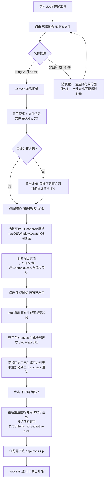
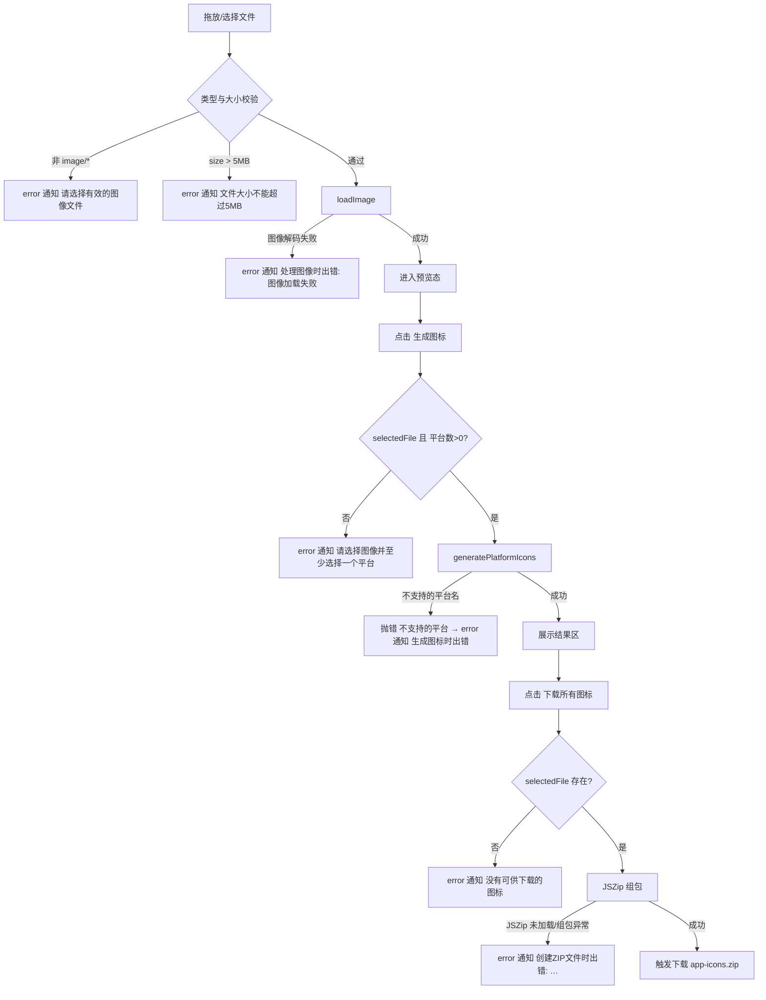
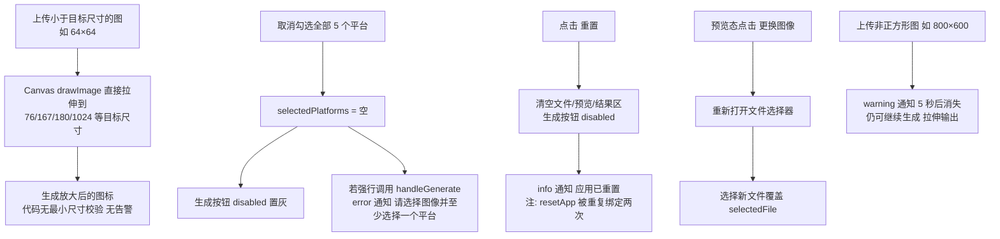

# IconGen（lys-icon-gen / iconsize）旧项目逆向分析报告

> 本报告基于对 `/Users/luoyaosheng/Desktop/project/Open/IconGen` 全部源码、页面、配置、脚本与既有文档的逐文件阅读逆向得出。所有功能均注明来源文件；无法从代码确认的内容标注【未知】。报告日期：2026-09-02。

---

## ① 项目概述

### 产品定位
- 一句话定位：**多平台图标生成工具，快速生成 iOS/Android/macOS/Windows 所需各种尺寸图标**（来源：根 `README.md` 第 3、10 行）。
- lys Open Source 体系中的项目资产生成工具（来源：根 `README.md` 第 3 行；`web/public/index.html` 第 323 行）。
- 线上入口：
  - 项目站 `https://icon.open.i2kai.com`（来源：`web/public/CNAME`，内容为 `icon.open.i2kai.com`）
  - 在线工具 `https://icon.open.i2kai.com/tool/`（来源：根 `README.md` 第 6 行）
  - 源码仓库 GitHub `LuoYaoSheng/lys-icon-gen` / Gitee `luoyaosheng/lys-icon-gen`（来源：根 `README.md` 第 7-8 行）
- 历史品牌名「iconsize」仍存在于 desktop 应用（`desktop/package.json` name 字段为 `iconsize`，版本 3.0.0）与 landing-page（`landing-page/index.html` title「iconsize | 多平台图标生成工具」）。

### 技术架构
| 部分 | 技术栈 | 来源 |
|---|---|---|
| web 在线工具（主产品） | 原生 HTML/CSS/JS + HTML5 Canvas 图像缩放 + JSZip 3.10.1（CDN 引入）打包下载；Express 4 仅作静态服务器（本地开发用） | `web/public/tool/index.html`、`web/public/js/*.js`、`web/server.js`、`web/package.json` |
| 项目主页（web） | 单文件静态页（内联 CSS），GitHub Pages 部署 | `web/public/index.html`、`.github/workflows/pages.yml` |
| desktop 桌面壳 | Electron 25 + electron-store 8 持久化配置 + nativeImage 系统级图像处理；electron-builder/packager 多平台打包；Docker 交叉构建 | `desktop/package.json`、`desktop/src/main/*.js`、`desktop/Dockerfile*` |
| landing-page | 静态 HTML + Google Fonts + Font Awesome 6.4.0（CDN）+ 原生 JS 动效 | `landing-page/index.html`、`landing-page/assets/**` |

- 部署链路：push 到 master → GitHub Actions 将 `./web/public` 发布到 GitHub Pages（来源：`.github/workflows/pages.yml`）。线上为纯静态，无需后端。
- 隐私特性：Web 版所有处理在浏览器内完成，不上传图片到服务器（来源：根 `README.md` 第 21 行；`web/README.md` 第 10 行）。

### 用户类型（从功能与文案推断，均有代码/文档佐证）
1. 移动/App 开发者：需要一键产出 iOS AppIcon.appiconset、Android mipmap 全密度图标（来源：`web/public/js/iconSizes.js` 全部模板）。
2. 桌面应用开发者：需要 macOS icon_16x16~512x512@2x、Windows Square*Logo 系列（来源：`iconSizes.js` macOS/Windows 段）。
3. UI 设计师/独立开发者：landing-page 用户证言中出现的角色（来源：`landing-page/index.html` 第 303-321 行 testimonials）。

### 核心价值
- 上传 1 张图（建议 1024×1024 PNG）→ 一键生成 5 平台（iOS/Android/macOS/Windows/watchOS）全尺寸图标 + 符合平台规范的目录结构与资源文件（Contents.json / Android 自适应图标 XML），ZIP 一键下载（来源：根 `README.md` 第 26-32 行；`web/README.md` 第 5-15 行）。

---

## ② 项目结构分析

```
IconGen/
├── README.md                    # 总说明（两版本结构、尺寸清单、文件结构说明）
├── .github/workflows/pages.yml  # GitHub Pages 自动部署 web/public
├── doc/                         # 仅含图标素材 iconsize.jpg/.ico
├── web/                         # ★ 主产品：在线工具
│   ├── server.js                # Express 静态服务器（本地开发，PORT 3000）
│   ├── package.json             # express / jszip / nodemon
│   ├── build.sh                 # 生成 dist + nginx.conf.example + iconsize-web.zip
│   ├── iconsize-web.zip         # 构建产物（已提交进仓库）
│   └── public/                  # 部署目录（GitHub Pages 源）
│       ├── CNAME                # icon.open.i2kai.com
│       ├── index.html           # PAGE001 项目主页（内联 CSS 单文件）
│       ├── favicon.ico
│       ├── css/{style.css, responsive.css, styles.css}
│       ├── js/{iconSizes.js, imageProcessor.js, fileUtils.js, main.js}
│       ├── images/.gitkeep      # 空目录占位
│       └── tool/index.html      # PAGE002 在线工具主页面 ★核心
├── desktop/                     # 桌面壳（Electron，品牌 iconsize）
│   ├── src/main/{main.js, preload.js, iconGenerator.js}
│   ├── src/renderer/{index.html, renderer.js, styles.css}
│   ├── src/assets/（icns/ico/png/dmg 脚本/linux desktop）
│   ├── electron-builder.yml、Dockerfile*、docker-build*.sh
│   └── README.md / README-docker.md / README-offline.md
└── landing-page/                # 旧品牌 iconsize 产品落地页（静态站）
    ├── index.html               # PAGE003
    ├── styles.css               # 根目录遗留副本（629 行，未被引用）
    └── assets/{css/{styles.css,animations.css}, js/main.js, img/**}
```

三部分关系：
- `web/` 是当前主产品与唯一线上部署物（CI 只部署 `web/public`）。`web/public/index.html`（新简版主页）承担项目站，`web/public/tool/index.html` 承担工具本身。
- `desktop/` 是功能对等的 Electron 壳：主进程 `iconGenerator.js` 用 `nativeImage` 实现与 web Canvas 等价的生成/导出，并增加「输出目录选择、导出到文件夹、打开输出文件夹、配置持久化（electron-store）」等桌面专属能力（来源：`desktop/src/main/main.js` IPC handlers；`desktop/src/renderer/renderer.js`）。
- `landing-page/` 是独立营销站（旧品牌 iconsize），其下载区链接指向 Gitee releases 与在线工具 `https://icon.open.i2kai.com/tool/`（来源：`landing-page/index.html` 第 252-296 行）。它与 `web/` 无构建依赖。
- 遗留冗余：`web/public/css/styles.css` 未被任何 HTML 引用（tool/index.html 与 index.html 均只引 style.css/responsive.css 或内联样式）；`landing-page/styles.css`（根目录）与 `landing-page/assets/css/styles.css` 内容不同且前者未被引用（来源：两文件 diff 校验 + index.html link 标签）。

---

## ③ 页面清单表

| 编号 | 页面 | 入口 | 文件 | 状态 |
|---|---|---|---|---|
| PAGE001 | 项目主页（Icon Gen 品牌介绍 + 工具入口） | `https://icon.open.i2kai.com/`、本地 `http://localhost:3000/` | `web/public/index.html` | 已实现（静态展示页，含导航/英雄区/能力卡/入口表） |
| PAGE002 | 在线图标生成工具（上传→设置→生成→下载 主流程） | PAGE001 导航「在线工具」/「打开在线工具」按钮；直访 `/tool/` | `web/public/tool/index.html`（+ `js/main.js` 等四个脚本） | 已实现（核心主流程可用；结果区仅平台列表，图标网格为遗留样式，见 ⑨） |
| PAGE003 | iconsize 产品落地页（营销页：特性/效果/步骤/下载/FAQ/联系） | 独立域名部署【未知具体域名，页面内无自引用】 | `landing-page/index.html`（+ assets/css、assets/js/main.js） | 部分实现（展示与 FAQ/滚动动效可用；联系表单、移动端菜单等交互失效，见 ⑨） |

附注（非浏览器页面，不编页面号）：desktop 渲染窗口 `desktop/src/renderer/index.html`（Electron 桌面壳单窗口应用，逻辑同 PAGE002 主流程 + 本地导出），在 ②⑨ 中分析。

---

## ④ 页面详细分析

### PAGE001 项目主页（web/public/index.html）

- **目的**：承载 lys Open Source 品牌与 Icon Gen 项目介绍，把流量导向在线工具与源码仓库。
- **入口**：站点根路径 `/`（Express `res.sendFile(public/index.html)`，来源 `web/server.js` 第 11-13 行；GitHub Pages 根路径）。
- **页面元素**：
  - 顶栏：品牌「IG / Icon Gen」（链接 `/`）、导航：能力(#features)、使用(#usage)、在线工具(/tool/)、Open 体系(open.i2kai.com/projects#icon-gen)、GitHub、Gitee（第 302-315 行）。
  - 英雄区：eyebrow「lys Open Source」、H1「多平台应用图标生成工具。」、lead 一段（第 318-330 行）、三个按钮（打开在线工具→/tool/、GitHub 源码、Gitee 源码）、右侧预览卡片（macOS 窗口隐喻，8 个尺寸瓦片 16/32/64/128/180/256/512/1024）（第 332-350 行）。
  - 能力区（#features）：3 张卡（多平台规格 / 标准目录结构 / 浏览器本地处理）（第 353-370 行）。
  - 使用入口区（#usage）：meta 表格 4 行（在线工具 /tool/、源码仓库、项目体系、本地运行命令 `cd web && npm install && npm start`）（第 372-397 行）。
  - 页脚：「Icon Gen · Part of lys Open Source · LuoYaoSheng」（第 400-402 行）。
- **用户操作与系统响应**：锚点跳转（#features/#usage）、页内链接跳转 /tool/ 与外部仓库。无表单、无脚本（该页无 `<script>`）。
- **状态变化**：无动态状态（纯静态）。
- **异常情况**：无（无 JS 交互层）。
- **数据来源**：全部硬编码于 HTML。
- **响应式**：≤860px 单列（第 288-298 行媒体查询）。

### PAGE002 在线图标生成工具（web/public/tool/index.html + js/）

- **目的**：完成「上传一张图 → 选平台与输出选项 → 生成 → ZIP 下载」的核心任务。
- **入口**：PAGE001 导航与按钮；直访 `/tool/`。
- **元素与结构**（tool/index.html）：
  1. header：H1「图标生成器」+ 副标题「上传一个图像，轻松生成各平台所需的应用图标」。
  2. 上传卡片（#uploadSection）：拖放区 #dropArea 内含上传态（云上传 SVG 图标、提示「拖放图像到这里或点击上传」、hint「建议上传1024×1024像素的PNG图像」、按钮 #uploadBtn「选择图像」、隐藏 file input accept="image/*"）与预览态（#previewContent 默认 display:none：预览图 #previewImage、文件信息 #fileInfo「未选择文件」、按钮 #changeImageBtn「更换图像」）。
  3. 设置卡片：选择平台组（5 个复选卡片：iOS✅、Android✅ 默认选中；macOS、Windows、watchOS 未选中）；输出选项组（4 个复选框：createSubFolders✅「为每个平台创建子文件夹」、prefixFilename「文件名添加平台前缀」、createContentsJson✅「为iOS/macOS创建Contents.json文件」、createAdaptiveIcons✅「为Android创建自适应图标相关文件」）；按钮区（#generateBtn「生成图标」初始 disabled、#resetBtn「重置」）。
  4. 结果卡片（#resultSection 默认 display:none）：#resultContent（占位 SVG + 「生成图标后将在这里显示」）、下载区按钮 #downloadZipBtn「下载所有图标」（btn-success）。
  5. footer：版权「© 2023 图标生成器 | 使用 HTML, CSS 和 JavaScript 构建」。
  6. 通知组件：#notification 固定右下角（CSS `position:fixed; bottom:20px; right:20px`，来源 style.css 第 432-445 行）。
- **用户操作 → 系统响应**（来源 `web/public/js/main.js`）：
  - 点击「选择图像」/「更换图像」/ 点击拖放区空白（注：点击上传是绑在按钮上，拖放区本身未绑 click）→ 触发 file input（main.js 第 66-67 行）。
  - 拖放文件：dragover 时拖放区加 .active 高亮，dragleave 移除，drop 取第一个文件进入 processFile（第 70-72、127-158 行）。
  - 选中文件 processFile（第 191-239 行）：
    - 非 `image/*` → 通知「请选择有效的图像文件」error（第 193-196 行）。
    - > 5MB（5*1024*1024）→ 通知「文件大小不能超过5MB」error（第 199-202 行）。
    - 通过 → loadImage（URL.createObjectURL）→ 预览图显示，上传态隐藏、预览态 flex，fileInfo 更新为「文件名: X | 大小: Y | 尺寸: W×Hpx」（formatFileSize B/KB/MB，第 476-484 行）。
    - 非正方形（isSquare() false）→ 警告通知「警告：图像不是正方形，可能会导致图标变形」warning，5 秒（第 226-228 行）。
    - 成功 → 通知「图像已成功加载」success；生成按钮按「已选平台数>0」启用（第 231-234 行）。
    - loadImage 失败 → 「处理图像时出错: …」error（第 235-238 行）。
  - 平台复选框 change → updatePlatformSelections 刷新 selected 数组与卡片 .selected 样式；生成按钮 disabled = !(有平台 && 有文件)（第 164-185 行）。
  - 输出选项 change → 写入 config 对象（第 107-110 行）。
  - 点击「生成图标」handleGenerate（第 244-287 行）：
    - 前置不满足（无文件或无平台）→ 「请选择图像并至少选择一个平台」error。
    - 显示 info 通知「正在生成图标，请稍候...」（duration 0 不自动隐藏）→ 逐平台 generatePlatformIcons（Canvas 逐尺寸 drawImage 缩放，blob+dataURL，来源 imageProcessor.js 第 231-273 行）→ createFileStructure 组装结构元数据（fileUtils.js 第 236-254 行）→ showDownloadSection：结果区显示「已生成以下平台的图标:」平台 chip 列表 + 「点击下面的按钮下载所有生成的图标 (ZIP格式)」→ 显示 #resultSection 并平滑滚动到位 → success 通知「图标已成功生成，可以下载」。
    - 异常 → 「生成图标时出错: …」error。
  - 点击「下载所有图标」downloadAllIcons（第 350-403 行）：
    - 无文件 → 「没有可供下载的图标」error。
    - info 通知「正在准备下载...」→ 重新逐平台生成 → fileUtils.createZipFile 用 JSZip 组 ZIP（目录结构见 F022）→ generateAsync blob → 创建 a[download="app-icons.zip"] 触发下载 → 100ms 后 revokeObjectURL → success「下载已开始」。
    - 异常 → 「创建ZIP文件时出错: …」error。
  - 点击「重置」resetApp（第 408-437 行）：清 file input、恢复上传态、隐藏结果区、禁用生成按钮、imageProcessor.reset()、fileInfo 复位「未选择文件」、info 通知「应用已重置」。
- **状态变化**：
  - 拖放区：empty（上传态）↔ loaded（预览态）↔ hover/active（拖拽悬停）。
  - 生成按钮：disabled（初始/重置/无平台）↔ enabled（有文件且 ≥1 平台）。
  - 结果区：hidden ↔ shown（平台列表 + 下载按钮）。
  - 通知：info/success/error/warning 四色（style.css 第 458-473 行：info 青 #17a2b8、success 绿 #28a745、error 红 #dc3545、warning 黄 #ffc107）。
- **异常情况汇总**：非图片文件、>5MB、图像解码失败、生成过程抛错、ZIP 组包失败、未选平台/未传文件点生成、无结果点下载——均有对应 error 通知（见上）。
- **数据来源**：ICON_SIZES / PLATFORM_FORMATS / PLATFORM_FOLDERS / PLATFORM_CONFIGS 常量（iconSizes.js）；用户上传的本地文件（File API）；全部客户端计算，无网络请求（唯一外部资源为 JSZip CDN 脚本，tool/index.html 第 13 行）。
- **响应式**（responsive.css）：≥1200px / 768-1199 / <767（通知条通栏、按钮纵排）/ <480（平台两列）/ 横屏矮屏压缩。

### PAGE003 iconsize 产品落地页（landing-page/index.html）

- **目的**：营销转化——介绍 iconsize、引导下载桌面版或使用网页版。
- **入口**：独立静态站（仓库内无部署配置指向它，部署方式【未知】）。
- **元素**：
  - 头部：logo 图 + 「iconsize」、汉堡按钮 `.mobile-menu-toggle`、导航菜单（特性/使用方法/下载/常见问题/联系我们/Gitee 外链）（第 26-46 行）。
  - 英雄区：H1「一键生成所有平台图标」、简介、按钮「立即下载」(#download)/「了解更多」(#how-it-works)、4 个平台图标（Apple/Android/Windows/Linux）、演示 GIF、浮动圆/图标背景装饰（第 50-80 行）。
  - 特性区（#features）：6 卡（快速生成/多平台支持/开发者友好/桌面应用/图像优化/结构化输出）（第 83-140 行）。
  - 效果展示区：源图 → iOS(180/120/80)/Android(192/144/96)/macOS-Windows(256/128/64) 尺寸预览（第 143-185 行）。
  - 使用流程（#how-it-works）：5 步（准备源图像→上传→选平台→生成→下载使用）（第 188-237 行）。
  - 下载区（#download）：4 选项（macOS DMG / Windows 安装包 / Linux AppImage，均链 Gitee releases/tag/3.0.0；网页版链 `https://icon.open.i2kai.com/tool/`）+ 网页版提示 + 应用截图 + 3 条用户证言（第 240-323 行）。
  - FAQ（#faq）：6 个手风琴问答（源图像建议/支持平台/集成方式/批量处理【答：桌面版暂不支持，未来版本】/是否联网【答：不需要】/是否免费）（第 326-377 行）。
  - 联系区（#contact）：5 种联系方式（邮件 support@iconsize.com、Gitee Issues、Twitter @iconsizeapp、社区讨论 discussions.iconsize.com、微信公众号「极客第一行」）+ 联系表单（姓名/邮箱/主题/消息，均 required + 「发送消息」按钮，form id=contactForm）（第 380-467 行）。
  - 页脚：品牌简介、社交图标（Gitee 有效，Twitter/LinkedIn/微博为 # 死链）、导航、联系、法律信息（隐私政策/使用条款/许可协议/贡献指南，均为 # 死链）、版权与开发者信息（第 471-525 行）。
- **用户操作 → 系统响应**（来源 `landing-page/assets/js/main.js`）：
  - 锚点链接平滑滚动（offset -80px）（第 30-45 行，重复绑定一次于第 233-254 行）。
  - 头部滚动 >100px 加 .scrolled 样式（第 17-27 行）。
  - 滚动进入视口元素加 .animated 触发 CSS 入场动画（第 47-74 行）。
  - FAQ 手风琴：点击问题展开/收起，互斥（initFaqAccordion，第 257-277 行）。
  - 以下 JS 功能绑定选择器与 HTML 不匹配，实际不生效（详见 ⑨）：移动端菜单（JS 查 `.menu-toggle`，HTML 是 `.mobile-menu-toggle`）、联系表单提交（JS 查 `#contact-form`，HTML 是 `#contactForm`）、系统检测推荐下载卡（JS 查 `.download-card[data-os]`，HTML 是 `.download-option` 无 data-os）。
- **状态变化**：FAQ 项 active 展开；头部 scrolled；元素 animated。
- **异常情况**：无错误处理逻辑（表单验证代码存在但从未绑定）。
- **数据来源**：全部硬编码；外部资源 Google Fonts、Font Awesome CDN、本地图片（iconsize.jpg/gif/截图 1.jpg）。

---

## ⑤ 功能清单表

> 状态定义：已实现=代码可运行达成该功能；部分实现=入口存在但行为不完整/与文档不符；未实现=仅有文档或样式，无生效代码。

| ID | 功能 | 入口 | 实现位置 | 状态 |
|---|---|---|---|---|
| F001 | 图像上传（按钮选择文件） | PAGE002 上传卡片「选择图像」 | `web/public/js/main.js:66`（uploadBtn→fileInput.click）+ `tool/index.html:38-39` | 已实现 |
| F002 | 图像上传（拖放） | PAGE002 拖放区 | `main.js:70-72,127-138`（dragover/dragleave/drop） | 已实现 |
| F003 | 文件类型校验（非 image/* 拒绝） | PAGE002 上传后 | `main.js:193-196` | 已实现 |
| F004 | 文件大小校验（>5MB 拒绝） | PAGE002 上传后 | `main.js:199-202` | 已实现 |
| F005 | 图像预览与文件信息（名/大小/尺寸） | PAGE002 预览态 | `main.js:204-223`、`imageProcessor.js:22-58` | 已实现 |
| F006 | 更换图像 | PAGE002「更换图像」 | `main.js:67` | 已实现 |
| F007 | 非正方形图像警告 | PAGE002 上传后 | `main.js:226-228`、`imageProcessor.js:88-90` | 已实现 |
| F008 | 平台选择（5 平台，默认 iOS+Android） | PAGE002 设置卡片 | `tool/index.html:66-87`、`main.js:11,164-185` | 已实现 |
| F009 | 输出选项（子文件夹/前缀/Contents.json/自适应图标 4 开关） | PAGE002 设置卡片 | `tool/index.html:90-110`、`main.js:35-40,98-110` | 已实现 |
| F010 | 生成图标（Canvas 逐尺寸缩放，blob+dataURL） | PAGE002「生成图标」 | `main.js:244-287`、`imageProcessor.js:231-273` | 已实现 |
| F011 | 生成结果展示（已生成平台列表 + 下载提示） | PAGE002 结果卡片 | `main.js:293-325` | 已实现（仅列表，图标网格未渲染，见 ⑨） |
| F012 | ZIP 打包下载（app-icons.zip，含完整目录结构/资源文件） | PAGE002「下载所有图标」 | `main.js:350-403`、`fileUtils.js:266-324`、JSZip CDN（tool/index.html:13） | 已实现 |
| F013 | 重置应用 | PAGE002「重置」 | `main.js:408-437`（注意被绑定两次，见 ⑨） | 已实现 |
| F014 | 通知组件（info/success/error/warning，可设定时长/常驻） | PAGE002 全局 | `main.js:445-469`、`tool/index.html:149-153`、`style.css:432-473` | 已实现 |
| F015 | iOS 尺寸模板（15 项：20/40/60/29/58/87/40/80/120/76/152/167/120/180/1024，含 @2x/@3x 与 ipad/ios-marketing idiom） | PAGE002 选 iOS 生成时 | `iconSizes.js:7-23` | 已实现 |
| F016 | Android 尺寸模板（launcher 36/48/72/96/144/192 + adaptive 前景 108/162/216/324/432） | PAGE002 选 Android 生成时 | `iconSizes.js:26-39` | 已实现 |
| F017 | macOS 尺寸模板（10 项：16/32(16@2x)/32/64(32@2x)/64…512/1024(512@2x)） | PAGE002 选 macOS 生成时 | `iconSizes.js:42-53` | 已实现 |
| F018 | Windows 尺寸模板（10 项：Square16/24/32/44/48/64/96/128/256 + StoreLogo 200） | PAGE002 选 Windows 生成时 | `iconSizes.js:56-67` | 已实现 |
| F019 | watchOS 尺寸模板（11 项：48/55/58/87/80/88/100/172/196/216/1024，含 role/subtype） | PAGE002 选 watchOS 生成时 | `iconSizes.js:70-82` | 已实现 |
| F020 | Contents.json 生成（iOS/macOS/watchOS，images+info{version:1,author:"Icon Generator"}） | F012 打包时按选项 | `fileUtils.js:23-56` | 已实现 |
| F021 | Android 自适应图标 XML（values/ic_launcher_background.xml + 各密度 mipmap ic_launcher.xml） | F012 打包时按选项 | `fileUtils.js:63-88` | 已实现 |
| F022 | 平台子文件夹结构（iOS系 Assets.xcassets/AppIcon.appiconset；Android res/mipmap-*/values；Windows Assets） | F012 打包时按选项 | `fileUtils.js:111-167,282-303`、`iconSizes.js:104-130` | 已实现 |
| F023 | 文件名平台前缀（非子文件夹模式下 `ios-`/`android-` 等小写前缀） | F012 打包时按选项 | `fileUtils.js:135-137` | 已实现 |
| F024 | 项目主页信息展示与工具引流 | PAGE001 | `web/public/index.html`（静态） | 已实现 |
| F025 | GitHub Pages 自动部署（push master → 发布 web/public） | CI | `.github/workflows/pages.yml` | 已实现 |
| F026 | 落地页导航/平滑滚动/头部滚动样式/入场动画/FAQ 手风琴 | PAGE003 | `landing-page/assets/js/main.js:17-74,257-277` | 已实现 |
| F027 | 落地页下载入口（3 桌面平台 Gitee releases 3.0.0 + 网页版 /tool/） | PAGE003 下载区 | `landing-page/index.html:240-297` | 已实现（链接有效性取决于外部 Gitee，本仓库无法验证【未知】） |
| F028 | 落地页联系表单（校验+提交成功提示） | PAGE003 联系区 | `landing-page/assets/js/main.js:280-328` | 未实现生效（绑定 `#contact-form`，HTML 实为 `#contactForm`，第 441 行；无后端） |
| F029 | 落地页移动端菜单开合 | PAGE003 汉堡按钮 | `landing-page/assets/js/main.js:163-184` | 未实现生效（绑定 `.menu-toggle`，HTML 实为 `.mobile-menu-toggle`，index.html 第 33 行） |
| F030 | 落地页系统检测推荐下载（detectOS+推荐徽标） | PAGE003 下载区 | `landing-page/assets/js/main.js:77-114` | 未实现生效（查 `.download-card[data-os]`，HTML 为 `.download-option` 且无 data-os 属性） |
| F031 | 落地页其余预留动效（打字机/图片预览弹窗/主题切换/复制代码按钮/版本号填充） | PAGE003 | `landing-page/assets/js/main.js:331-413,424-439,447-465` | 未实现生效（页面无对应元素 .typewriter/.preview-link/.theme-toggle/.copy-btn/.version-number/.code-block） |
| F032 | 桌面版：本地生成（nativeImage）与导出到文件夹、打开输出文件夹、配置持久化、应用菜单（打开图片 Cmd+O / 导出 Cmd+E / 关于） | desktop 渲染窗口 | `desktop/src/main/main.js`、`iconGenerator.js`、`renderer/renderer.js` | 已实现（但 createContentsJson 选项不生效，见 ⑨） |

---

## ⑥ 用户流程

### 流程 1：正常流程（上传 → 生成 → 下载）



### 流程 2：异常流程（上传失败 / 生成失败 / 下载失败）



### 流程 3：边界流程（小图放大 / 全部平台取消 / 重置 / 换图 / 未选平台生成）



---

## ⑦ 数据模型

### 实体 1：平台尺寸模板 PlatformIconSpec（常量，来源 `web/public/js/iconSizes.js`；桌面版对应 `desktop/src/main/iconGenerator.js:6-82`，size 为 'WxH' 字符串）
| 字段 | 类型 | 说明 | 来源示例 |
|---|---|---|---|
| size | Number(web)/String(desktop) | 图标边长（px） | 180 / '180x180' |
| name | String | 输出文件名 | icon-60@3x.png、ic_launcher.png、Square44Logo.png |
| folder | String | 平台内目标目录 | AppIcon.appiconset、mipmap-xhdpi、Assets |
| idiom | String? | Apple 资产术语 | iphone / ipad / ios-marketing / watch / watch-marketing |
| scale | String? | 像素倍率 | 1x / 2x / 3x（Windows 为 '100'） |
| role | String? | watchOS 用途 | notificationCenter / companionSettings / appLauncher / longLook / quickLook |
| subtype | String? | watchOS 表壳 | 38mm / 42mm / 44mm |
| type | String? | Android 图标类型 | launcher / adaptive |
| description | String? | 中文说明（仅 web 版有） | 通知图标@2x |

平台集合：iOS、Android、macOS、Windows、watchOS（iconSizes.js 五键）。

### 实体 2：平台资源配置 PlatformConfig（来源 `iconSizes.js:104-130` PLATFORM_CONFIGS / PLATFORM_FOLDERS / PLATFORM_FORMATS）
| 字段 | 说明 | 值示例 |
|---|---|---|
| needsContentsJson | 是否生成 Contents.json | iOS/macOS/watchOS=true |
| needsAdaptiveIcons | 是否生成自适应图标文件 | Android=true |
| needsManifest | 是否生成清单 | Windows=false（空实现） |
| assetsDir / iconsetDir | Apple 资产目录 | Assets.xcassets / AppIcon.appiconset |
| resDir / mipmapDirs / valuesDir | Android 资源目录 | res / mipmap-ldpi…xxxhdpi / values |
| 格式 | PLATFORM_FORMATS | 五平台均 'png' |

### 实体 3：导出配置 Config（web 内存态 `main.js:35-40`；desktop 持久化 electron-store，键见 `main.js(get-config)`）
| 字段 | 默认值 | 说明 |
|---|---|---|
| createSubFolders | true | 平台子文件夹 |
| prefixFilename | false | 文件名平台前缀（仅非子文件夹模式生效） |
| createContentsJson | true | Apple Contents.json |
| createAdaptiveIcons | true | Android 自适应图标 XML |
| selectedPlatforms | ['iOS','Android'] | 已选平台（desktop 持久化） |
| lastOutputPath | null | 输出目录（仅 desktop 持久化） |

### 实体 4：生成图标 GeneratedIcon（web：`imageProcessor.js:242-273` 返回；desktop：`iconGenerator.js:128-139`）
web：{ size, name, folder, blob(Blob), dataURL, ...metadata }；desktop：{ size, name, folder, idiom, scale, role, subtype, type, dataUrl, buffer(PNG Buffer) }。
关系：GeneratedIcon 1..n 属于 平台；平台 1..1 对应 PlatformIconSpec 列表；Config 控制打包阶段（fileUtils）的路径与附加文件。

### 实体 5：通知 Notification（UI 态，`main.js:445-469`）
{ message, type: info|success|error|warning, duration(ms, 0=常驻) }。

---

## ⑧ 外部依赖

| 依赖 | 用途 | 引用位置 | 说明 |
|---|---|---|---|
| JSZip 3.10.1（cdnjs CDN） | 浏览器端 ZIP 组包 | `web/public/tool/index.html:13` | 线上依赖 CDN；`web/package.json` 亦声明 jszip 依赖但页面未走打包，仅 CDN |
| Express ^4.18.2 / nodemon | 本地开发静态服务器 | `web/server.js`、`web/package.json` | 线上 GitHub Pages 不需要 |
| GitHub Pages + Actions（upload-pages-artifact@v3 / deploy-pages@v4） | 站点部署 | `.github/workflows/pages.yml` | CNAME=icon.open.i2kai.com |
| Google Fonts（Montserrat/Roboto/Source Code Pro） | 落地页字体 | `landing-page/index.html:13-15` | CDN |
| Font Awesome 6.4.0（cdnjs） | 落地页图标 | `landing-page/index.html:18` | CDN |
| Electron ^25.2.0 / electron-store ^8.1.0 / electron-builder ^24.6.3 / electron-packager ^17.1.2 | 桌面壳运行与打包 | `desktop/package.json` | 无其他三方运行时依赖 |
| Docker（多 Dockerfile + docker-build*.sh） | Windows/mac/Linux 离线交叉构建 | `desktop/Dockerfile*`、`desktop/README-docker.md`、`README-offline.md` | 含国内镜像 .npmrc |
| Gitee Releases（iconsize 3.0.0） | 落地页桌面安装包分发 | `landing-page/index.html:252-280` | 外链可用性【未知】 |

后端 API：无（全部客户端/本地处理；server.js 仅为静态文件服务，无任何业务接口）。

---

## ⑨ 未完成能力

### 已实现
- Web 主流程闭环：上传（点选+拖放）→ 校验（类型/5MB/正方形警告）→ 预览与信息 → 平台/选项配置 → Canvas 多尺寸生成 → 结果平台列表 → JSZip 结构化打包下载（F001-F023）。
- 五平台完整尺寸模板与平台规范目录（Assets.xcassets/AppIcon.appiconset、res/mipmap-*/values、Assets）。
- Contents.json（含 role/subtype/scale/idiom）与 Android 自适应图标 XML 生成。
- 通知系统四态、重置、响应式三档以上断点。
- 主页 + 工具页 GitHub Pages 自动部署。
- 落地页展示型功能（FAQ 手风琴、平滑滚动、入场动画、头部滚动态）。
- 桌面版独立闭环（nativeImage 生成、导出到本地目录、打开输出目录、electron-store 配置持久化、原生菜单 Cmd+O/Cmd+E、关于对话框、紧凑/展开双窗口尺寸）。

### 部分实现（行为与入口/文档不完全一致）
1. **结果区图标网格缺失**：`style.css` 定义了 `.result-tabs/.result-tab/.result-grid/.icon-item/.icon-name/.icon-size` 完整样式（style.css 第 317-401 行），`main.js` 中也有 filterResults/showPlatformResult/initTabs 处理逻辑（第 331-531 行），但 showDownloadSection 实际只渲染平台名称列表（第 293-325 行），从不生成图标网格 DOM——CSS/JS 为「孤儿功能」，界面上看不到任何生成后的图标预览与单尺寸过滤。
2. **桌面版 createContentsJson 选项不生效**：渲染进程把 createContentsJson 传入 export-icons IPC（renderer.js 第 476-483 行），但主进程 exportIcons 未接收转发（main.js 第 315-339 行只传 createSubFolders/prefixFilename），`createContentJsonFile` 对 iOS/macOS/watchOS 无条件执行（iconGenerator.js 第 184-186 行）——取消勾选仍会生成 Contents.json。
3. **文档与代码的尺寸清单不一致**：根 README「支持的图标尺寸」未收录 watchOS 段（README 第 67-78 行只有 iOS/Android/MacOS/Windows）；根 README Windows 缺 44×44 与 StoreLogo 200×200（代码 iconSizes.js 第 60、66 行均有）；web README Windows 含 44 无 24（代码含 24，iconSizes.js 第 58 行）；desktop 版 Windows 模板无 24×24、watchOS 模板与 web 版集合不同（desktop 多 66×66/40×40，少 87×87/80×80/216 一致但 web 有 icon-29@3x 87 而 desktop watchOS 无，见两文件对比）。
4. **「单个下载」未实现**：web README 第 62 行「下载生成的图标（单个下载或打包下载）」，代码只有 ZIP 整包下载（downloadAllIcons），无单图标下载入口。
5. **resetBtn 双重绑定**：main.js 第 87 行 setEventListeners 内绑定一次，第 534-538 行又在第二个 DOMContentLoaded 中绑定一次——点击「重置」会执行 resetApp 两次（两次通知「应用已重置」，实际状态幂等无数据损坏）。
6. **web 版 Android 自适应 XML 的 foreground 引用写法**：`@${mipmapDir}/ic_launcher_foreground`（fileUtils.js 第 83 行）把 mipmap 目录写进 drawable 引用，与 desktop 版 `@mipmap/ic_launcher_foreground`（iconGenerator.js 第 343 行）不一致，前者非 Android 标准引用形式（按源码如实记录）。

### 未实现
1. 落地页联系表单提交（选择器 `#contact-form` vs HTML `#contactForm`，无后端）——F028。
2. 落地页移动端菜单（选择器 `.menu-toggle` vs HTML `.mobile-menu-toggle`）——F029。
3. 落地页系统检测推荐下载卡（`.download-card[data-os]` 无匹配元素）——F030。
4. 落地页打字机/图片预览弹窗/主题切换/复制代码/版本号填充（JS 存在、HTML 无对应元素）——F031。
5. Windows 清单文件（needsManifest=false，createWindowsManifest 为空函数，fileUtils.js 第 95-100 行）。
6. 批量多图标处理（落地页 FAQ 自述「目前桌面应用每次只能处理一个图标，计划未来版本」，index.html 第 355-359 行）。
7. favicon/PWA 图标生成（落地页 FAQ 声称支持「网页图标（favicon、PWA 图标）」（index.html 第 344 行），但 web/desktop 代码均无对应模板——文档超承诺）。
8. 裁剪/编辑能力：无任何裁剪、留白、圆角、背景色配置（源码无相关代码；README 亦未声称）。

### 明显 bug / 死链照实记录
- desktop 帮助菜单 GitHub 链接为占位符 `https://github.com/yourusername/icon-generator`（main.js 第 165 行）——死链。
- 落地页页脚法律信息 4 项与 Twitter/LinkedIn/微博社交链接均为 `#` 死链（index.html 第 482-516 行）。
- `landing-page/styles.css`（根目录 629 行）与 `web/public/css/styles.css` 为未被引用的遗留文件。
- `web/iconsize-web.zip` 构建产物提交进仓库（build.sh 生成）。
- 落地页联系邮箱 support@iconsize.com / Twitter @iconsizeapp / discussions.iconsize.com 无其它佐证，真实性【未知】。
- web/tool 页脚版权年份 2023、落地页版权 2023——未随时间更新（按源码记录）。
