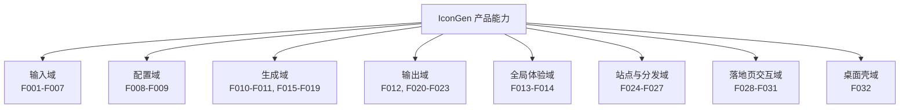

# IconGen 产品能力树（FEATURE_MAP）

> 功能 ID（F001-F032）沿用逆向报告⑤与 PRD §5 的既有编号，按能力分组组织为能力树。状态定义：已实现=代码可运行达成；部分实现=入口存在但行为不完整；未实现生效=仅有代码/文档，无生效路径。来源：`docs/01_reverse/REVERSE_ANALYSIS.md` ⑤ 功能清单表；`docs/02_product/PRD.md` §5。编写日期：2026-09-03。

---

## 0. 能力树总览

## 1. 输入域（F001-F007）——PAGE002 上传卡片

| ID | 功能 | 状态 | 实现位置 |
|---|---|---|---|
| F001 | 按钮选择上传（accept=image/*） | 已实现 | `web/public/js/main.js:66` + `tool/index.html:38-39` |
| F002 | 拖放上传（dragover 高亮/drop 取首个） | 已实现 | `main.js:70-72,127-138` |
| F003 | 文件类型校验（非 image/* 拒绝） | 已实现 | `main.js:193-196` |
| F004 | 文件大小校验（>5MB 拒绝） | 已实现 | `main.js:199-202` |
| F005 | 预览与文件信息（名/大小/尺寸） | 已实现 | `main.js:204-223`、`imageProcessor.js:22-58` |
| F006 | 更换图像 | 已实现 | `main.js:67` |
| F007 | 非正方形警告（warning 5 秒不阻断） | 已实现 | `main.js:226-228`、`imageProcessor.js:88-90` |

## 2. 配置域（F008-F009）——PAGE002 设置卡片

| ID | 功能 | 状态 | 实现位置 |
|---|---|---|---|
| F008 | 平台选择（5 平台，默认 iOS+Android） | 已实现 | `tool/index.html:66-87`、`main.js:11,164-185` |
| F009 | 输出选项 4 开关（子文件夹/前缀/Contents.json/自适应图标） | 已实现 | `tool/index.html:90-110`、`main.js:35-40,98-110` |

## 3. 生成域（F010-F011、F015-F019）——Canvas 多尺寸生成

| ID | 功能 | 状态 | 实现位置 |
|---|---|---|---|
| F010 | 生成图标（Canvas 逐尺寸缩放，blob+dataURL） | 已实现 | `main.js:244-287`、`imageProcessor.js:231-273` |
| F011 | 结果展示（平台列表 + 下载提示） | 已实现（仅列表；图标网格为孤儿代码，FN-02） | `main.js:293-325` |
| F015 | iOS 尺寸模板（15 项，含 @2x/@3x、idiom） | 已实现 | `iconSizes.js:7-23` |
| F016 | Android 尺寸模板（launcher 6 密度 + adaptive 前景 5 密度） | 已实现 | `iconSizes.js:26-39` |
| F017 | macOS 尺寸模板（10 项 16~1024 含 @2x） | 已实现 | `iconSizes.js:42-53` |
| F018 | Windows 尺寸模板（Square16~256 + StoreLogo200，10 项） | 已实现 | `iconSizes.js:56-67` |
| F019 | watchOS 尺寸模板（11 项含 role/subtype） | 已实现 | `iconSizes.js:70-82` |

## 4. 输出域（F012、F020-F023）——ZIP 结构化打包下载

| ID | 功能 | 状态 | 实现位置 |
|---|---|---|---|
| F012 | ZIP 打包下载（app-icons.zip，含目录结构/资源文件） | 已实现 | `main.js:350-403`、`fileUtils.js:266-324`、JSZip CDN |
| F020 | Contents.json 生成（Apple 系三平台） | 已实现 | `fileUtils.js:23-56` |
| F021 | Android 自适应图标 XML（background + 各密度 ic_launcher.xml） | 已实现（前景引用写法非标准，PL-02） | `fileUtils.js:63-88` |
| F022 | 平台子文件夹结构（Assets.xcassets / res/mipmap-* / Assets） | 已实现 | `fileUtils.js:111-167,282-303`、`iconSizes.js:104-130` |
| F023 | 文件名平台前缀（仅非子文件夹模式） | 已实现 | `fileUtils.js:135-137` |

## 5. 全局体验域（F013-F014）——通知与重置

| ID | 功能 | 状态 | 实现位置 |
|---|---|---|---|
| F013 | 重置应用 | 已实现（旧版双重绑定 bug，FN-01） | `main.js:408-437` |
| F014 | 通知组件（info/success/error/warning 四态） | 已实现 | `main.js:445-469`、`style.css:432-473` |

## 6. 站点与分发域（F024-F027）——PAGE001/PAGE003/CI

| ID | 功能 | 状态 | 实现位置 |
|---|---|---|---|
| F024 | 项目主页信息展示与工具引流 | 已实现 | `web/public/index.html`（静态） |
| F025 | GitHub Pages 自动部署（push master → 发布 web/public） | 已实现 | `.github/workflows/pages.yml` |
| F026 | 落地页展示与动效（导航/滚动/动画/FAQ 手风琴） | 已实现 | `landing-page/assets/js/main.js:17-74,257-277` |
| F027 | 落地页下载入口（3 桌面平台 Gitee releases 3.0.0 + 网页版 /tool/） | 已实现（外链可用性【未知】） | `landing-page/index.html:240-297` |

## 7. 落地页交互域（F028-F031）——失效交互

| ID | 功能 | 状态 | 实现位置 |
|---|---|---|---|
| F028 | 联系表单（校验+提交成功提示） | 未实现生效（绑定 `#contact-form` vs HTML `#contactForm`） | `landing-page/assets/js/main.js:280-328` |
| F029 | 移动端菜单开合 | 未实现生效（绑定 `.menu-toggle` vs HTML `.mobile-menu-toggle`） | `main.js:163-184` |
| F030 | 系统检测推荐下载 | 未实现生效（查 `.download-card[data-os]` 无匹配元素） | `main.js:77-114` |
| F031 | 落地页扩展动效（打字机/预览弹窗/主题切换/复制/版本号） | 未实现生效（HTML 无对应元素） | `main.js:331-413,424-439,447-465` |

## 8. 桌面壳域（F032）——Electron desktop

| ID | 功能 | 状态 | 实现位置 |
|---|---|---|---|
| F032 | 本地生成（nativeImage）/导出到文件夹/打开输出文件夹/配置持久化（electron-store）/应用菜单（Cmd+O 打开、Cmd+E 导出、关于） | 已实现（createContentsJson 选项不生效 bug，FN-08；随 C-4 决策） | `desktop/src/main/main.js`、`iconGenerator.js`、`renderer/renderer.js` |

## 9. 能力分组统计

| 分组 | 功能数 | 已实现 | 部分/未实现生效 |
|---|---|---|---|
| 输入域 | 7 | 7 | 0 |
| 配置域 | 2 | 2 | 0 |
| 生成域 | 7 | 7（F011 仅列表） | 0 |
| 输出域 | 5 | 5（F021 有 PL-02 写法缺陷） | 0 |
| 全局体验域 | 2 | 2 | 0 |
| 站点与分发域 | 4 | 4 | 0 |
| 落地页交互域 | 4 | 0 | 4 |
| 桌面壳域 | 1 | 1（含已知 bug） | 0 |
| **合计** | **32** | **28** | **4** |

> 优先级（P0-P3）与验收标准（Given-When-Then）见 `docs/02_product/PRD.md` §5/§8；已知缺陷与处置分级（A/B/C/D）见 `docs/06_review/PRODUCT_REVIEW.md` 与 `docs/product-review/PRODUCT_LOGIC_REVIEW.md` §八。
