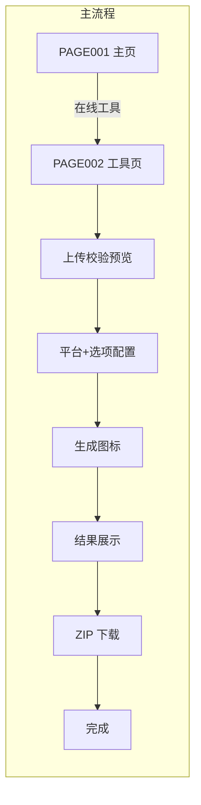
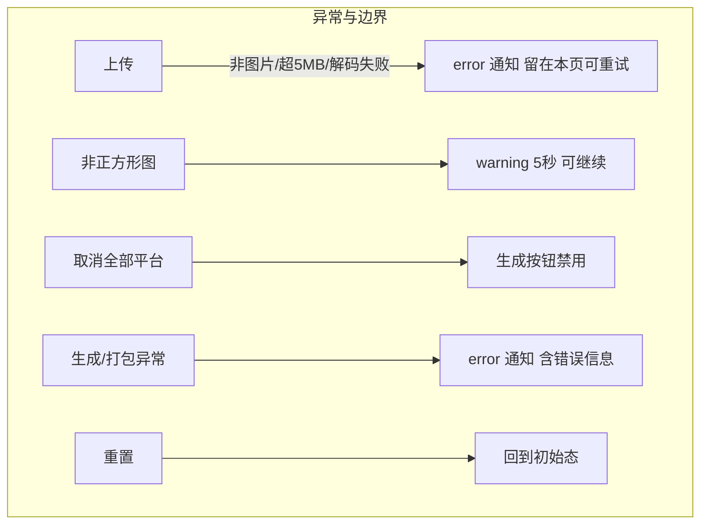
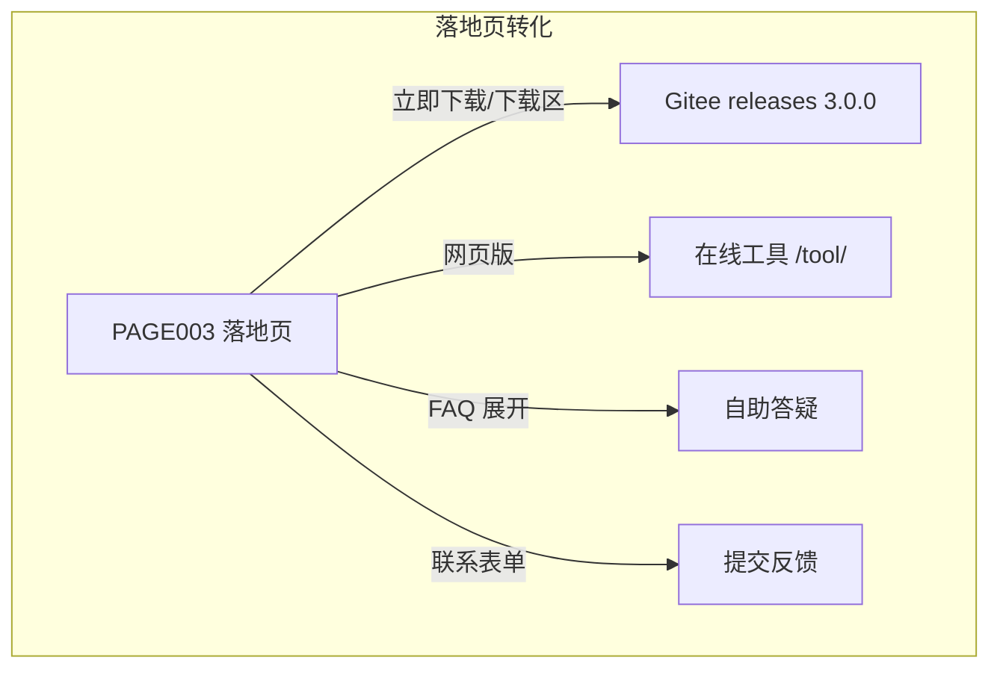

# IconGen 产品需求文档（PRD）

> 本 PRD 基于 `docs/01_reverse/REVERSE_ANALYSIS.md` 的逆向事实编写，是对旧项目（以 web 在线工具为主产品）重新开发的需求基线。功能 ID 与逆向报告⑤节一致；所有需求均源自旧项目实际存在的行为（含已知缺陷是否沿用见「验收标准」注记）。禁止新增旧项目不存在的商业功能。

---

## 1. 产品介绍

IconGen（在线品牌「Icon Gen」，桌面/落地页历史品牌「iconsize」）是多平台应用图标生成工具：用户上传一张高质量图标源图，浏览器本地（不上传服务器）即可生成 iOS、Android、macOS、Windows、watchOS 五平台全部所需尺寸图标，并按平台规范输出目录结构与资源文件（Contents.json、Android 自适应图标 XML），一键 ZIP 下载。

- 产品形态：浏览器在线工具（主）+ 项目主页（导流）+ 落地页（营销）+ Electron 桌面壳（本地文件系统导出）。本 PRD 页面需求聚焦浏览器侧三页（PAGE001-PAGE003），桌面壳作为能力附录。
- 核心原则：客户端处理、零上传、零登录、零收费（Apache-2.0 开源）。

## 2. 用户画像

| 画像 | 特征 | 核心诉求 | 来源 |
|---|---|---|---|
| App 开发者（主力） | 使用 Xcode/Android Studio | 一次上传得到可直接拖入工程的 AppIcon.appiconset 与 mipmap 全密度资源 | 逆向报告⑤F015-F022；落地页证言 |
| 桌面应用开发者 | 打包 Windows/macOS 应用 | Square*Logo 系列、icon_16~512@2x 系列 | F017/F018 |
| UI 设计师/独立开发者 | 交付多端图标资产 | 快速、免费、结构化输出 | 落地页 testimonials（PAGE003） |

## 3. 使用场景

1. 上架前补齐图标：开发者只有一张 1024×1024 设计稿，5 分钟内拿到全部平台图标包（主场景，PAGE002）。
2. 临时替换图标：改版后快速重新生成全套（重置→换图→生成→下载）。
3. 了解工具与获取桌面版：从项目主页/落地页进入下载或在线工具（PAGE001/PAGE003）。
4. 隐私敏感场景：图片不出本机（web 端浏览器内处理；桌面端完全离线）。

## 4. 功能架构

```
IconGen 在线工具（PAGE002）
├── 输入模块
│   ├── 文件选择上传（F001）
│   ├── 拖放上传（F002）
│   └── 校验：类型（F003）/大小≤5MB（F004）/正方形警告（F007）
├── 预览模块：预览图+文件信息（F005）、更换图像（F006）
├── 配置模块：平台选择 5 项（F008）、输出选项 4 项（F009）
├── 生成模块：Canvas 逐尺寸缩放（F010），尺寸模板×5（F015-F019）
├── 结果模块：平台列表+提示（F011）
├── 下载模块：JSZip 结构化打包（F012）
│   ├── 目录结构（F022）/前缀（F023）
│   ├── Contents.json（F020）/Android 自适应 XML（F021）
├── 全局：通知四态（F014）、重置（F013）
项目主页（PAGE001）= 静态导流（F024）+ CI 部署（F025）
落地页（PAGE003）= 营销+FAQ+下载入口（F026/F027）±失效交互（F028-F031）
桌面壳 = 本地生成/导出/持久化（F032）
```

## 5. 功能列表表

| 功能ID | 名称 | 描述 | 优先级 | 状态 |
|---|---|---|---|---|
| F001 | 按钮选择上传 | 「选择图像」按钮唤起文件选择器（accept=image/*） | P0 | 已实现（旧版） |
| F002 | 拖放上传 | 拖放区支持 dragover 高亮/drop 取首个文件 | P0 | 已实现 |
| F003 | 文件类型校验 | 非 image/* → 错误通知「请选择有效的图像文件」 | P0 | 已实现 |
| F004 | 文件大小校验 | >5MB → 错误通知「文件大小不能超过5MB」 | P0 | 已实现 |
| F005 | 预览与文件信息 | 显示预览图与「文件名/大小(B/KB/MB)/尺寸W×Hpx」 | P0 | 已实现 |
| F006 | 更换图像 | 预览态「更换图像」重新选文件并覆盖 | P0 | 已实现 |
| F007 | 非正方形警告 | W≠H → 黄色警告通知 5 秒「图像不是正方形，可能会导致图标变形」 | P1 | 已实现 |
| F008 | 平台选择 | iOS/Android（默认选中）、macOS/Windows/watchOS 复选卡片；实时刷新选中样式与生成按钮可用性 | P0 | 已实现 |
| F009 | 输出选项 | 4 开关：子文件夹(默认开)/平台前缀(默认关)/Contents.json(默认开)/自适应图标(默认开) | P0 | 已实现 |
| F010 | 生成图标 | 点击生成：逐平台 Canvas 缩放生成全部尺寸（PNG blob+dataURL） | P0 | 已实现 |
| F011 | 结果展示 | 结果区显示已生成平台列表 + ZIP 下载提示，平滑滚动定位 | P0 | 已实现（旧版仅列表） |
| F012 | ZIP 下载 | 「下载所有图标」重新生成并按选项组 ZIP，浏览器下载 app-icons.zip | P0 | 已实现 |
| F013 | 重置 | 清空文件/预览/结果，生成按钮禁用，通知「应用已重置」 | P1 | 已实现（旧版重复执行 bug 需修复：只执行一次） |
| F014 | 通知组件 | info/success/error/warning 四态右下角通知，可设时长(0=常驻) | P0 | 已实现 |
| F015 | iOS 尺寸模板 | 15 项含 @2x/@3x、iphone/ipad/ios-marketing | P0 | 已实现 |
| F016 | Android 尺寸模板 | launcher 6 密度 + adaptive 前景 5 密度 | P0 | 已实现 |
| F017 | macOS 尺寸模板 | 10 项 16~1024 含 @2x | P0 | 已实现 |
| F018 | Windows 尺寸模板 | 10 项 Square16~256 + StoreLogo200 | P0 | 已实现 |
| F019 | watchOS 尺寸模板 | 11 项含 role/subtype | P1 | 已实现 |
| F020 | Contents.json 生成 | iOS/macOS/watchOS 的 AppIcon.appiconset/Contents.json（images+info） | P0 | 已实现 |
| F021 | Android 自适应 XML | values/ic_launcher_background.xml + 各密度 ic_launcher.xml | P1 | 已实现 |
| F022 | 平台子文件夹结构 | Assets.xcassets / res/mipmap-*/values / Assets 标准目录 | P0 | 已实现 |
| F023 | 文件名平台前缀 | 非子文件夹模式下加小写平台前缀 | P2 | 已实现 |
| F024 | 项目主页展示 | 品牌区/英雄区/3 能力卡/入口表/页脚 | P1 | 已实现 |
| F025 | 自动部署 | push master → GitHub Pages 发布 web/public | P1 | 已实现 |
| F026 | 落地页展示与动效 | 导航平滑滚动、头部滚动态、入场动画、FAQ 手风琴 | P2 | 已实现 |
| F027 | 落地页下载入口 | 3 桌面平台(Gitee 3.0.0) + 网页版(/tool/) | P2 | 已实现 |
| F028 | 联系表单 | 姓名/邮箱/主题/消息 + 校验 + 成功提示 | P2 | 未实现生效（旧版绑定错误） |
| F029 | 移动端菜单 | 汉堡按钮开合导航 | P2 | 未实现生效（旧版绑定错误） |
| F030 | 系统检测推荐下载 | 按 UA 标记推荐平台 | P2 | 未实现生效（旧版无匹配元素） |
| F031 | 落地页扩展动效 | 打字机/图片预览/主题切换/复制按钮/版本号 | P3 | 未实现生效 |
| F032 | 桌面壳能力 | nativeImage 生成、导出目录、打开输出文件夹、配置持久化、菜单 | P1 | 已实现（createContentsJson 选项不生效 bug 待修复） |

> 优先级依据：核心闭环=P0；体验增强/次平台=P1；营销辅助/边缘选项=P2/P3。重开发时 P0 必须交付，其余按旧项目实际状态对齐（失效交互要么修复要么明确不做，不得静默保留死按钮）。

## 6. 页面需求

### PAGE001 项目主页
- 编号/目标：承接品牌展示与导流到 /tool/ 与源码仓库。
- 入口：站点根路径 `/`。
- 展示内容：顶栏（品牌 IG/Icon Gen + 导航：能力、使用、在线工具、Open、GitHub、Gitee）；英雄区（eyebrow「lys Open Source」、大标题、简介、3 按钮、右侧 8 尺寸瓦片预览卡）；能力区 3 卡（多平台规格/标准目录结构/浏览器本地处理）；使用入口表（在线工具/源码仓库/项目体系/本地运行命令）；页脚。
- 操作：锚点跳转、链接跳转（/tool/、GitHub、Gitee、open.i2kai.com）。
- 响应：浏览器默认导航行为。
- 状态：纯静态，无状态。
- 异常：无。
- 数据：硬编码。

### PAGE002 在线图标生成工具（核心页）
- 编号/目标：完成上传→配置→生成→下载全流程。
- 入口：PAGE001「在线工具」；直访 /tool/。
- 展示内容：
  1. 标题区（H1 图标生成器 + 副标题）。
  2. 上传卡片：拖放区两态——上传态（SVG 图标+「拖放图像到这里或点击上传」+hint「建议上传1024×1024像素的PNG图像」+「选择图像」按钮）/预览态（预览图+「文件名:…|大小:…|尺寸:W×Hpx」+「更换图像」）。
  3. 设置卡片：平台 5 复选卡片（iOS、Android 默认选中）；输出选项 4 复选框；按钮「生成图标」（初始禁用）、「重置」。
  4. 结果卡片（初始隐藏）：「已生成以下平台的图标:」平台列表 + 「点击下面的按钮下载所有生成的图标 (ZIP格式)」+「下载所有图标」按钮。
  5. 页脚 + 右下角通知条。
- 操作与响应：
  - 选择/拖放文件 → 校验 → 预览态切换 → 文件信息更新 →（非正方形则警告）→ success「图像已成功加载」→ 生成按钮按条件启用。
  - 切换平台/选项 → 即时更新选中态与 config。
  - 生成图标 → 常驻 info「正在生成图标，请稍候...」→ 结果区出现平台列表并平滑滚动 → success「图标已成功生成，可以下载」。
  - 下载所有图标 → 常驻 info「正在准备下载...」→ 组 ZIP → 触发浏览器下载 app-icons.zip → success「下载已开始」。
  - 重置 → 回初始状态 + info「应用已重置」。
- 状态：上传区（空/已载入/拖拽悬停）、生成按钮（禁用/可用）、结果区（隐藏/显示）、通知（四色+常驻/自动消失）。
- 异常：非图片、>5MB、解码失败、生成异常、ZIP 异常、无平台点生成、无文件点下载——各出 error 通知（文案见验收标准）。
- 数据：ICON_SIZES 等常量 + 用户本地文件；无网络请求（JSZip 需可用）。

### PAGE003 iconsize 落地页
- 编号/目标：营销转化（下载桌面版/跳网页版）。
- 入口：独立部署域名【未知】。
- 展示内容：头部导航（logo+6 链接+汉堡）；英雄区（标题/简介/立即下载/了解更多/4 平台图标/演示 GIF/浮动装饰）；特性 6 卡；效果展示（源图→三平台尺寸预览）；使用流程 5 步；下载区 4 选项+网页版提示+截图+3 证言；FAQ 6 条（手风琴）；联系区（5 联系方式+表单）；页脚（4 栏+版权）。
- 操作：锚点平滑滚动（-80px 偏移）；FAQ 展开/收起（互斥）；下载外链新窗口打开；（重开发时决定）联系表单校验+模拟提交、移动端菜单开合。
- 响应：滚动>100px 头部变实底；元素进入视口播放入场动画。
- 状态：FAQ active、header scrolled、元素 animated。
- 异常：表单必填缺失→行内错误（旧版设计如此但未生效；重开发按规格实现）。
- 数据：硬编码；Google Fonts/Font Awesome（原型中需去外链化）。

## 7. 业务流程







## 8. 验收标准（Given-When-Then）

**F001/F002 上传**
- Given 用户在 PAGE002，When 点击「选择图像」并选中一张 PNG，Then 弹出文件选择器且成功进入预览态。
- Given 拖放区可见，When 将图片文件拖入并松开，Then 文件被读取并进入预览态；dragover 时拖放区高亮。

**F003 类型校验**：Given 选择了一个 .txt 文件，When 确认选择，Then 出现 error 通知「请选择有效的图像文件」，页面停留上传态。

**F004 大小校验**：Given 选择 6MB 图片，When 确认，Then error 通知「文件大小不能超过5MB」。

**F005 预览信息**：Given 成功加载 1024×1024 的 icon.png(约245KB)，When 预览态显示，Then fileInfo 为「文件名: icon.png | 大小: 245.00 KB | 尺寸: 1024×1024px」格式。

**F006 更换图像**：Given 已处于预览态，When 点击「更换图像」并选新文件，Then 预览与信息更新为新文件。

**F007 正方形警告**：Given 上传 800×600 图片，When 加载完成，Then warning 通知「警告：图像不是正方形，可能会导致图标变形」显示 5 秒后消失，流程不被阻断。

**F008 平台选择**：Given 未上传文件，When 反复切换平台复选框，Then 生成按钮保持禁用；Given 已上传文件，When 至少勾选 1 平台，Then 生成按钮启用，When 全部取消，Then 重新禁用。

**F009 输出选项**：When 切换 4 个选项任一，Then 配置即时保存并在后续 ZIP 中生效（前缀仅非子文件夹模式）。

**F010 生成**：Given 已上传且选 iOS+Android，When 点击「生成图标」，Then 出现常驻 info「正在生成图标，请稍候...」，完成后结果区列出 iOS、Android，并出现 success「图标已成功生成，可以下载」，页面平滑滚动至结果区。

**F012 ZIP 下载**：Given 结果已生成（子文件夹+Contents.json+自适应图标均开），When 点击「下载所有图标」，Then 浏览器下载 app-icons.zip，且包内包含 iOS/Assets.xcassets/AppIcon.appiconset/（icon-*.png + Contents.json）、Android/res/mipmap-*/（ic_launcher.png、ic_launcher_foreground.png、ic_launcher.xml）、Android/res/values/ic_launcher_background.xml。

**F013 重置**：Given 任意中间状态，When 点击「重置」，Then 上传区回到空态、结果区隐藏、生成按钮禁用、出现 info「应用已重置」（仅一次——旧版双重绑定 bug 修复项）。

**F014 通知**：When 各类事件触发，Then 右下角出现对应颜色通知（info 青/success 绿/error 红/warning 黄），默认 3 秒消失，loading 类常驻直至显式隐藏。

**F015-F019 尺寸模板**：When 分别仅选单一平台生成，Then ZIP 内该平台文件与逆向报告⑦实体 1 的清单逐项一致（iOS 15 项/Android 11 项/macOS 10 项/Windows 10 项/watchOS 11 项）。

**F020 Contents.json**：Given iOS 勾选且 createContentsJson 开，Then Contents.json 含 15 条 images（含 idiom/scale，marketing 条目）与 info{version:1,author:"Icon Generator"}；Given 关闭该选项，Then ZIP 中无 Contents.json（对齐 web 版行为；桌面版旧 bug 不沿用）。

**F023 前缀**：Given 关闭子文件夹且开启前缀，Then 文件名形如 ios-icon-20.png、android-ic_launcher.png。

**PAGE001**：Given 访问 /，When 点击「打开在线工具」，Then 跳转 /tool/。

**PAGE002 页脚**：页面底部显示「© 2023 图标生成器 | 使用 HTML, CSS 和 JavaScript 构建」（照旧还原）。

**PAGE003**：Given 页面加载，When 点击任一 FAQ 问题，Then 该项展开其余收起；When 滚动超过 100px，Then 头部出现滚动态样式；When 点击导航锚点，Then 平滑滚动至目标（-80px 偏移）。

**F028 联系表单（重开发修复项）**：Given 必填项为空，When 点击「发送消息」，Then 对应字段标红且不提交；Given 全部填写，When 提交，Then 显示成功提示并重置表单。

**F029 移动端菜单（重开发修复项）**：Given 视口为移动宽度，When 点击汉堡按钮，Then 导航菜单开合切换，点击菜单项后自动收起。
