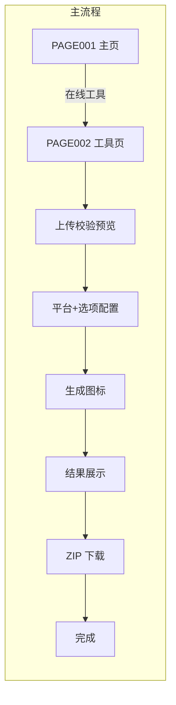
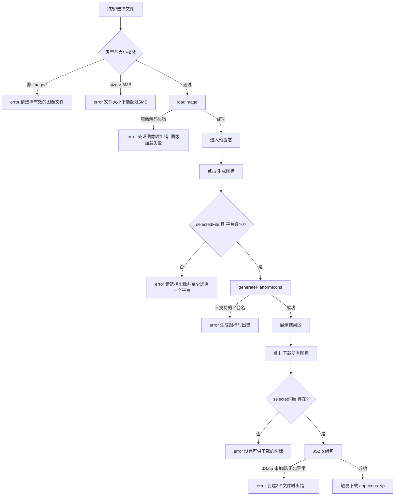

# IconGen 业务流程（BUSINESS_FLOW）——正常 / 异常 / 边界

> 正常流程、异常流程（用户/系统/环境三类失败）、边界流程（含逻辑评审发现的换图失效、生成失败等）。改写自 `docs/01_reverse/REVERSE_ANALYSIS.md` ⑥（三张流程图的源码依据）、`docs/product-review/PRODUCT_LOGIC_REVIEW.md` §四/§八与 `docs/product-review/USER_FLOW_REVIEW.md` §三。只记录旧版实际行为；评审缺口以「⚠」+ 编号标注。编写日期：2026-09-03。

---

## 1. 正常流程（主链路：上传 → 配置 → 生成 → 下载）



来源：`docs/02_product/PRD.md` §7 主流程图。默认配置下配置步骤可零操作跳过（默认 iOS+Android 勾选、三选项开启，`tool/index.html:66-87`）。

## 2. 异常流程（三类失败）

### 2.1 用户失败（操作错误）——7 类 error 均已覆盖，文案具体、停留可重试（USER_FLOW_REVIEW §三 1）



来源：REVERSE_ANALYSIS ⑥ 流程 2；error 文案枚举见 `web/public/js/main.js:193-401` 各调用点。

### 2.2 系统失败（程序错误）

- 生成/组包异常：error 通知含 `{msg}`——有通知、无下一步指引（不告诉用户重试/换图/换浏览器）（USER_FLOW_REVIEW §三 2）。
- 常驻 loading 通知在异常路径已清理（`main.js:400` hideNotification）——无永久 loading，达标。
- ⚠ 生成中重入：web 无防护，生成按钮全程可再点，两轮全平台 Canvas 生成并发执行（UF-02/PL-05/ST-01；对照 desktop `renderer.js:415` 有禁用）。

### 2.3 环境失败（运行环境）

- ⚠ JSZip CDN 不可达：延迟到点击下载时才报「创建ZIP文件时出错: JSZip库未加载」（FL-02 可用性 + PM-05 供应链完整性：无 SRI/无 CSP）。
- ⚠ 旧浏览器/无 File API/Canvas：无检测无提示（UF-05/PL-21，D 类照旧）。
- GitHub Pages 站点不可达：静态站特性，无应用层兜底必要（不立项）。

## 3. 边界流程（含逻辑评审发现的边界）

```mermaid
flowchart TD
    subgraph 边界1 小图放大
    A[上传小于目标尺寸的图<br/>如 64×64] --> B[Canvas drawImage 直接拉伸到<br/>76/167/180/1024 等目标尺寸]
    B --> C[输出放大后的图标<br/>无最小尺寸校验 无告警<br/>⚠ PL-09 小图静默放大无提示]
    end
    subgraph 边界2 平台全取消
    D[取消勾选全部 5 个平台] --> E[selectedPlatforms = 空]
    E --> F[生成按钮 disabled 置灰]
    E --> G[若强行调用 handleGenerate<br/>error 请选择图像并至少选择一个平台]
    end
    subgraph 边界3 重置与换图
    H[点击 重置] --> I[清空文件/预览/结果区 生成按钮禁用]
    I --> J[info 应用已重置<br/>⚠ FN-01 双重绑定执行两次<br/>平台/选项勾选保留 照旧]
    K[预览态点击 更换图像] --> L[重新打开文件选择器]
    L --> M[选择新文件覆盖 selectedFile<br/>⚠ UF-01/PL-04 旧结果不清空不失效<br/>直接下载将用新图组包 所见非所得]
    end
    subgraph 边界4 非正方形图
    N[上传非正方形图 如 800×600] --> O[warning 通知 5 秒后消失]
    O --> P[仍可继续生成 拉伸输出<br/>⚠ FL-01 单通知条下 warning 会被紧随的 success 覆盖]
    end
    subgraph 边界5 生成后改配置
    Q[生成完成后再改平台/选项] --> R[结果区仍显示旧平台列表<br/>⚠ FL-04 结果不失效]
    R --> S[直接点下载按新配置组包<br/>与所见不一致 FN-09 同源]
    end
    subgraph 边界6 拖放多文件
    T[一次拖入多个文件] --> U[drop 取 files[0] 其余静默忽略<br/>FL-05 D 类照旧]
    end
```

来源：REVERSE_ANALYSIS ⑥ 流程 3（边界 1/2/3/4/6 的源码行为）；`docs/product-review/PRODUCT_LOGIC_REVIEW.md` §八（PL-04/PL-09 等编号）；PRODUCT_REVIEW（FN-01/FL-01/FL-04/FL-05）。

### 补充边界（逻辑评审新增，无图列示）

| 边界 | 行为 | 编号 | 来源 |
|---|---|---|---|
| 扁平模式（关子文件夹）下勾选 Contents.json / 自适应图标 | 两选项静默失效（资源文件仅在 createSubFolders 分支生成） | PL-03 | `fileUtils.js` createZipFile 约 301-315 行；PRODUCT_LOGIC_REVIEW §八 |
| 子文件夹模式下勾选「文件名平台前缀」 | 前缀静默失效（仅 !createSubFolders 时加前缀） | PG-06 | `fileUtils.js:135-137` |
| 文件选择器取消 | change 不触发，停留原态，无反馈 | FL-06（D 照旧） | PAGE_SPEC §4「用户取消」行 |
| desktop 向已有输出的目录再次导出 | `fs.writeFileSync` 直接覆盖同名文件，无确认 | UF-04/PL-13（C，随 C-4） | `desktop/src/main/iconGenerator.js:224` |
| web 下载后浏览器拦截/磁盘失败 | 应用层仅「下载已开始」，无落盘确认与兜底 | UF-03/PL-14（C） | `main.js:397`；USER_FLOW_REVIEW §四 |

## 4. V1 目标态流转（对照）

V1 状态机补齐 S4_Generating（生成中，防重入+平台级进度）与 S5_Stale（结果过期，黄条提示）两个旧版缺失态，异常路径统一「error 通知 + 状态回退（S4→S2、S6→S5）」——见 `docs/04_architecture/STATE_MACHINE.md` §2/§5。
