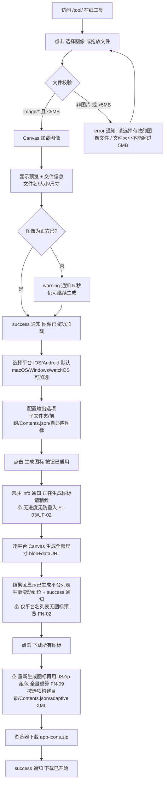
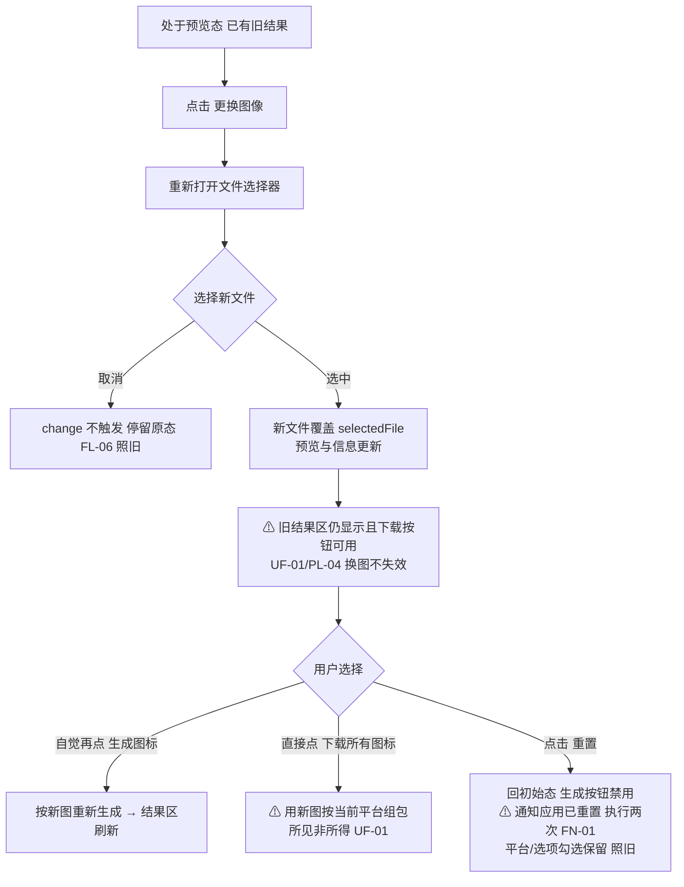
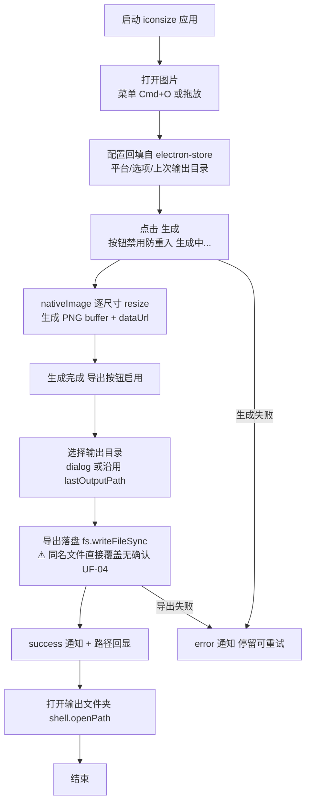
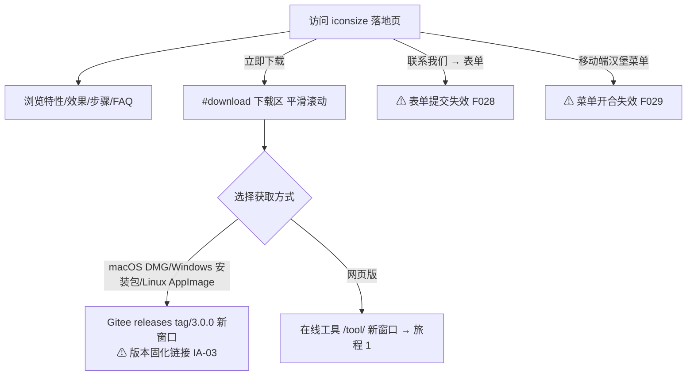

# IconGen 用户旅程（USER_FLOW）

> 覆盖 web 端（上传→配置→生成→下载）与 desktop 端两条旅程，另含落地页转化旅程；流程图改写自 `docs/01_reverse/REVERSE_ANALYSIS.md` ⑥（源码行号出处见该文）与 `docs/product-review/USER_FLOW_REVIEW.md` §一（流程 1/2/5）。只描述旧版实际行为；评审发现的缺口以「⚠」标注并注明编号。编写日期：2026-09-03。

---

## 旅程 1：web 端首次生成下载（主场景：上传→配置→生成→下载）

最短路径 = 3 次有效交互（上传 1 + 生成 1 击 + 下载 1 击；默认 iOS+Android 已勾选、三选项已开，配置可零操作跳过）（来源：USER_FLOW_REVIEW §一流程 1；`tool/index.html:66-87` 默认值）。

## 旅程 2：web 端临时替换图标（换图重生成场景，PRD §3 场景 2）

来源：`web/public/js/main.js:191-239`（processFile 不清空 resultSection）；USER_FLOW_REVIEW §一流程 2。

## 旅程 3：desktop 端本地生成导出（Electron 桌面壳）

来源：USER_FLOW_REVIEW §一流程 5（`desktop/src/renderer/renderer.js:55-83,415,487-489`；`desktop/src/main/iconGenerator.js:224`）；REVERSE_ANALYSIS ② 双端关系。

> desktop 与 web 的行为差异：desktop 生成期间禁用按钮（`renderer.js:415`），web 无此防护（UF-02）；desktop 配置持久化，web 刷新即失（DS-05，照旧）；desktop Contents.json 选项不生效（FN-08）。

## 旅程 4：落地页转化（PAGE003，营销路径）

来源：`landing-page/index.html:252-296`；USER_FLOW_REVIEW §一流程 4；`docs/product-review/INFORMATION_ARCHITECTURE_REVIEW.md` §四抽查 5。

## 五要素完整性结论（摘要）

| 流程 | 开始 | 操作 | 成功 | 失败 | 返回 | 结论 |
|---|---|---|---|---|---|---|
| 1 首次生成 | ✓ | ✓ | ✓ | ✓（7 类 error） | △ 无页面级回链（PG-03） | 不达标（返回） |
| 2 换图重生成 | ✓ | ✓ | △ 旧结果不清（UF-01） | ✓ | △ | 不达标（成功语义失真） |
| 3 主页→工具→回 | ✓ | ✓ | ✓ | — | ✗ 无回链 | 不达标（PG-03） |
| 4 落地页转化 | ✓ | ✓ | △ 外链成败无回执 | ✗ Gitee 失效无兜底 | △ | 部分不达标 |
| 5 desktop 导出 | ✓ | ✓ | ✓ | ✓ | ✓ | 基本达标（UF-04 覆盖确认缺失） |

来源：USER_FLOW_REVIEW §二总表。V1 目标状态机（补 S4 生成中/S5_Stale 过期态）见 `docs/04_architecture/STATE_MACHINE.md` §2。
