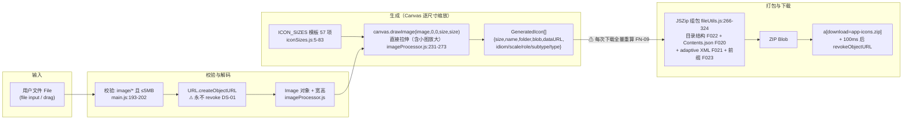
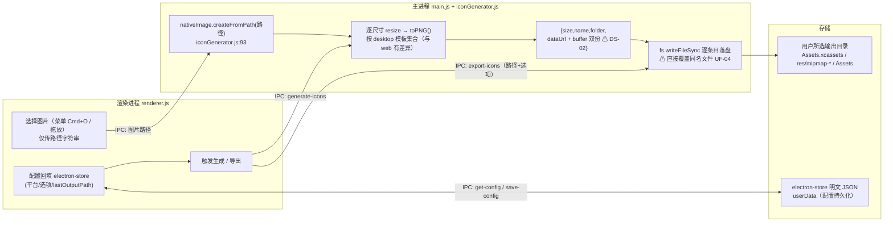

# IconGen 数据流动（DATA_FLOW）

> 数据主线：源图 → 缩放引擎（web=Canvas / desktop=nativeImage）→ 多尺寸产物 → 结构化打包（ZIP/落盘）。两条线并列描述，源码出处见 `docs/01_reverse/REVERSE_ANALYSIS.md` ④⑦、`docs/08_development/DATA_MODEL.md` §3 与 `docs/product-review/DATA_STORAGE_REVIEW.md` §一。编写日期：2026-09-03。

---

## 1. web 线（浏览器内闭环，零网络）

要点（均引自上述来源文档）：
1. 图片全程不离开浏览器（无网络请求；唯一外部资源为 JSZip CDN 脚本 `tool/index.html:13`）。
2. 生成在内存中完成（blob+dataURL），不缓存——点击下载时重新逐平台生成再组包（`main.js:359-365`，FN-09）。
3. 组包阶段按 ExportConfig（四开关）决定路径与附加文件：子文件夹模式 `{platform}/...`；扁平模式可加 `{platform.toLowerCase()}-` 前缀；Contents.json 仅 Apple 系×子文件夹模式；adaptive XML 仅 Android×子文件夹模式（`fileUtils.js:111-324`；⚠ PL-03 扁平模式选项静默失效）。
4. 会话态（file/platforms/options）全部内存，刷新即失（DS-05，照旧）。

## 2. desktop 线（Electron 双进程，本地文件系统）

要点：
1. 源图不复制，仅保存磁盘路径，生成时 fs 读取（DATA_STORAGE_REVIEW 表 #5）。
2. 产物 dataUrl+buffer 双份驻留内存且导出后不清空（DS-02，B，随 C-4）。
3. 导出走 `fs.writeFileSync` 直接覆盖写（UF-04，C，随 C-4）。
4. 配置经 electron-store 跨会话持久化（lastOutputPath/selectedPlatforms/四开关，明文 JSON，无 schema 版本 DS-03）。
5. 渲染进程直接 require('fs')/'electron'（PM-01 安全失守现状，目标态见 `docs/08_development/PERMISSION.md`）。

## 3. 双线对照表

| 环节 | web 线 | desktop 线 | 差异来源 |
|---|---|---|---|
| 输入 | File 对象（内存） | 磁盘路径（引用） | REVERSE_ANALYSIS ⑦实体 3/4 |
| 缩放引擎 | HTML5 Canvas drawImage + toBlob | Electron nativeImage resize + toPNG | REVERSE_ANALYSIS ① |
| 尺寸模板 | iconSizes.js（57 项） | iconGenerator.js:6-82（集合有差异：Windows 无 24×24 等） | REVERSE_ANALYSIS ⑨-3 |
| 产物 | blob + dataURL | dataUrl + PNG Buffer（双份） | DATA_STORAGE_REVIEW 表 #2/#6 |
| 交付 | JSZip → app-icons.zip（浏览器下载） | fs.writeFileSync → 用户目录 | F012 / F032 |
| 配置 | 会话内存（刷新失） | electron-store 持久化 | DS-05 |
| 已知缺陷 | 换图/改配置结果不失效（UF-01/FL-04）、下载重算（FN-09）、objectURL 泄漏（DS-01）、Android XML 引用写法（PL-02） | Contents.json 选项不生效（FN-08）、覆盖写（UF-04）、双份驻留（DS-02）、窗口尺寸双源（ST-04） | 各评审文件 |

## 4. V1 目标数据流（摘要）

V1（web 主产品）：生成结果缓存于 Store（task.result + configKey），下载复用不重算（ADR-3）；JSZip 构建期内置（ADR-2）；组包模型 ZipService.buildModel 供结果区预览与下载共用。详见 `docs/04_architecture/SYSTEM_ARCH.md` §4 与 `docs/08_development/API_SPEC.md` §4。
