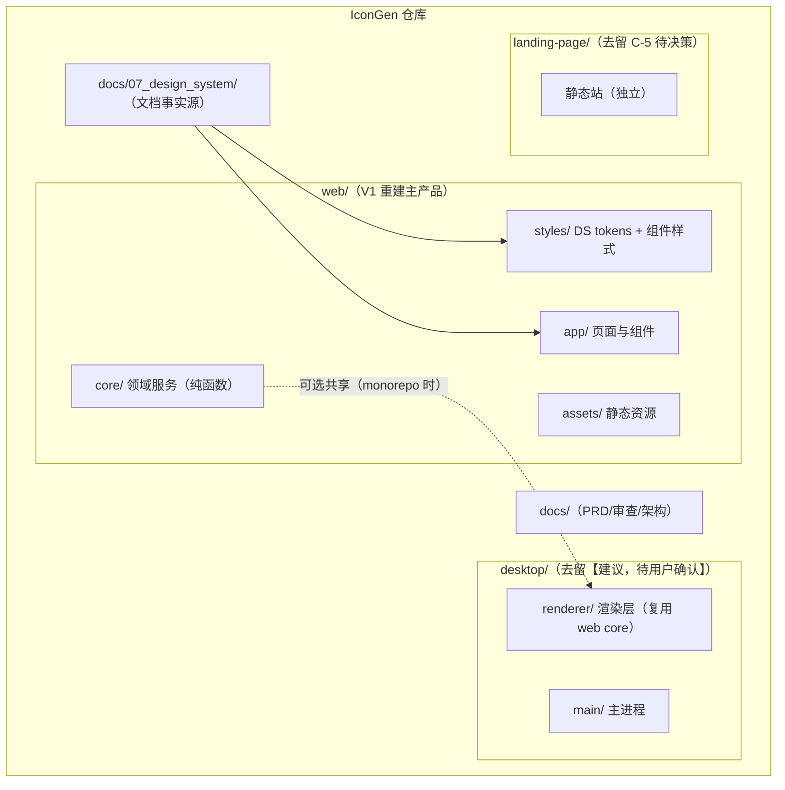

# IconGen 模块拆分建议（P7）

> 范围：web（主产品）/ desktop（Electron 壳）/ landing-page（营销站）三部分。拆分对齐 SYSTEM_ARCH.md 分层、product-review §4 公共能力（C/M/S/CF 编号）与 docs/07_design_system 组件清单。目录为建议形态，落地时按仓库现状调整。

---

## 1. 总览



## 2. web/ 模块拆分（V1 重建）

```
web/
├── public/                    # 构建产物（Pages 部署目录，CNAME 保留）
├── src/
│   ├── app/                   # 表现层（对应 product-review §4.2 模块）
│   │   ├── pages/
│   │   │   ├── home/          # M-04 英雄 / M-05 入口表（PAGE001，静态）
│   │   │   ├── tool/          # M-01 上传卡 / M-02 设置卡 / M-03 结果卡（PAGE002 核心）
│   │   │   └── landing/       # M-06~M-09（PAGE003，若 C-5 决策保留）
│   │   ├── components/        # DS COMPONENT.md 20 组件（业务 16 + 基础 4）
│   │   │   ├── DropZone/      # C-01
│   │   │   ├── PlatformCard/  # C-02
│   │   │   ├── SizeTemplateTable/  # DS §1.3（V1 新增 UI）
│   │   │   ├── OptionSwitch/  # C-03
│   │   │   ├── FileInfo/      # C-04
│   │   │   ├── Notification/  # C-05（队列）
│   │   │   ├── ResultTabs/    # C-08（启用）
│   │   │   ├── IconGrid/      # C-09（启用）
│   │   │   ├── ZipTree/       # DS §1.4（新增）
│   │   │   ├── DownloadButton/# F012 入口
│   │   │   ├── Card/ Button/  # C-06 C-07 基础
│   │   │   └── (FeatureCard/ PreviewTiles/ MetaTable/ DownloadCard/ FaqItem/ Steps/ FormField/ MobileMenu/)
│   │   └── controllers/       # 事件编排（对齐旧 main.js 职责）
│   │       └── toolController.ts
│   ├── core/                  # 领域层（零 DOM 依赖，可单测；API_SPEC.md 契约实现）
│   │   ├── services/
│   │   │   ├── templateService.ts   # S-01（iconSizes.js 迁移）
│   │   │   ├── fileService.ts       # S-03（校验/格式化）
│   │   │   ├── imageService.ts      # S-02（imageProcessor.js 迁移 + onProgress）
│   │   │   ├── zipService.ts        # S-04（fileUtils.js 迁移；JSZip npm 内置）
│   │   │   ├── downloadService.ts   # S-06
│   │   │   └── notifyService.ts     # S-05（队列化）
│   │   ├── models/            # DATA_MODEL.md 7 实体
│   │   └── store/             # STATE_MACHINE.md（toolStore + 发布订阅）
│   ├── styles/
│   │   ├── tokens.css         # docs/07_design_system/TOKEN.md 唯一变量源
│   │   └── components.css     # 组件样式（消费 tokens）
│   └── assets/                # favicon 等二进制（ASSETS.md §3 归位）
├── tests/                     # API_SPEC.md §8 契约测试 + 五态冒烟
├── vite.config.ts             # ADR：Vite 构建（可选，默认采纳）
└── package.json               # jszip(devDep 内置)、无运行时 CDN
```

拆分要点：
1. **core 与 app 分离**：core/ 不 import DOM（ImageService 的 Canvas 通过适配注入），tests/ 只测 core + 冒烟 app。
2. **旧文件去向映射**：iconSizes.js→core/services/templateService.ts；imageProcessor.js→imageService.ts；fileUtils.js→zipService.ts；main.js→app/controllers + store；style.css/responsive.css→styles/（按 TOKEN.md 重写）；tool/index.html→app/pages/tool；public/index.html→app/pages/home。旧 css/styles.css（未引用遗留）与 iconsize-web.zip 不迁移（D 类代码卫生）。
3. **公共能力落位**：product-review §4 全部 C-01~C-12 / M-01~M-09 / S-01~S-06 / CF-01~CF-05 在上述目录均有唯一归属。

## 3. desktop/ 模块拆分（去留【建议，待用户确认】，默认 V1 暂缓）

```
desktop/
├── src/
│   ├── main/                  # Electron 主进程
│   │   ├── main.js            # 窗口/菜单/IPC 编排
│   │   ├── preload.js         # contextBridge 白名单通道
│   │   └── iconGenerator.js   # nativeImage 生成（若保留：改为复用 web core 模板数据，消除模板差异）
│   └── renderer/              # 渲染层（若保留：直接加载 web 构建产物，删除自有 UI 三件套）
```

若用户决定保留（C-4），必须同步修复（对齐 product-review FN-08/FN-12/FL-08）：
1. exportIcons IPC 转发 createContentsJson 并在 iconGenerator 中条件执行（修旧 bug）。
2. 模板数据单一来源：主进程读 web core 的模板定义（Windows 补 24×24；watchOS 对齐 web 集合）。
3. 品牌 iconsize → Icon Gen 统一；帮助菜单死链改真实仓库；Electron 升级 LTS。
若决定放弃：desktop/ 目录整体归档移除，landing 下载卡改仅保留网页版入口（连带 C-5）。

## 4. landing-page/ 模块拆分（去留 C-5 待决策，默认不动）

```
landing-page/                  # 独立静态站（无构建）
├── index.html                 # 唯一页面（头部/英雄/特性/展示/步骤/下载/FAQ/联系/页脚）
├── assets/
│   ├── css/{styles.css, animations.css}
│   ├── js/main.js             # 若保留：修正 4 组失效选择器（或按 C-1/C-2 决策删除死代码）
│   └── img/
```

- 根目录遗留 styles.css（629 行未引用）不迁移（D 类）。
- 若 C-5 决策「合并」：landing 承担的内容并入 web 主页（PAGE001）与 PAGE003 新页，品牌统一 Icon Gen；域名【未知】需用户提供。

## 5. 三部分关系与共享策略

| 关系 | 现状（旧版） | V1 建议 |
|---|---|---|
| web ↔ desktop | 双份独立实现（模板/逻辑漂移已发生：Windows 24×24、watchOS 集合、XML 引用写法差异） | 桌面壳若保留，模板与组包规则必须复用 web/core（单一事实源 guidelines §4），渲染层直接加载 web 构建产物 |
| web ↔ landing | 无构建依赖；仅 landing 链接指向 /tool/ 与 Gitee releases | 维持独立；landing 去留/品牌统一待 C-5 |
| CI | 只部署 web/public | 维持（F025）；插入 core 契约测试作业 |

## 6. 迁移与验收顺序建议

1. core/（模板/校验/组包）+ 契约测试 → 2. store + PAGE002 工具页（F001-F023 闭环）→ 3. PAGE001 主页 → 4. PAGE003（按 C-5 决策）→ 5. desktop（按 C-4 决策）→ 6. 清理遗留（旧 css、zip 产物、死链）。
每步以 PRD §8 Given-When-Then + V1_ACCEPTANCE.md 用例集回归。
