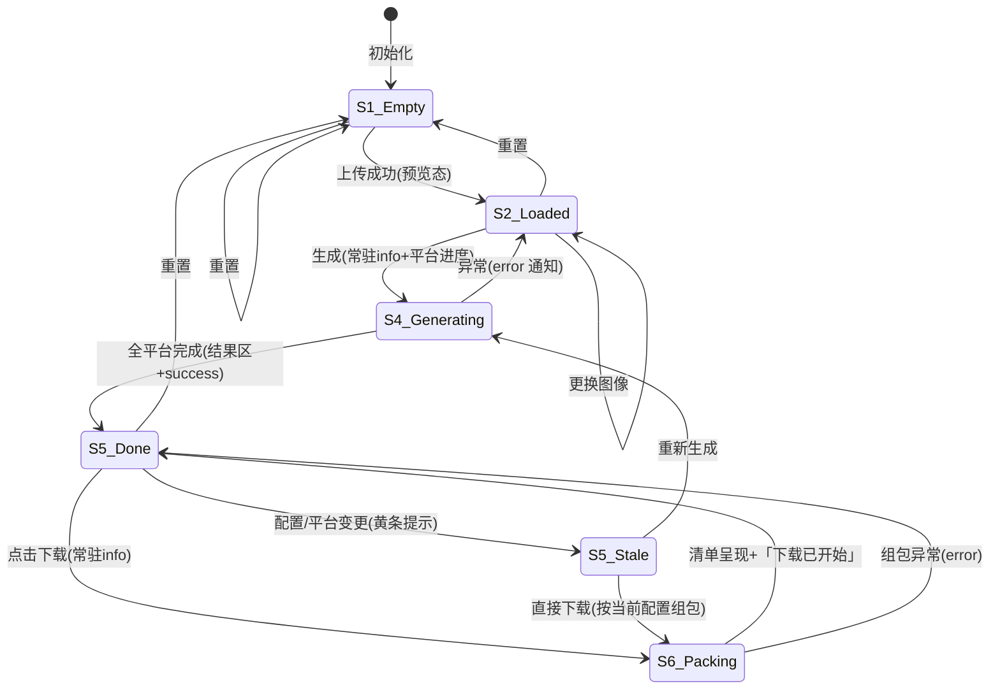

# IconGen 状态管理设计（P7）

> 对象：PAGE002 工具页（唯一有状态页面；PAGE001/PAGE003 为静态+局部 UI 态）。旧版状态散落于全局变量与 DOM（main.js:9-40），V1 收敛为单一 Store + 显式状态机。原型 `prototype/v1-new/app-prototype.html` 的 `state` 对象即本设计的可运行示意。

---

## 1. 状态分层

| 层 | 内容 | 持久化 |
|---|---|---|
| 会话态（Store） | 文件、平台、选项、任务、通知队列 | 无（刷新即重置，照旧） |
| 派生态（computed） | 生成按钮可用性、configKey、结果过期、ZIP 模型 | 由会话态推导，不独立存储 |
| 局部 UI 态 | 拖放高亮、Tab 激活、折叠面板开合、FAQ active、菜单 open、header scrolled | 组件内部，不入全局 Store |
| 静态常量 | 尺寸模板/平台配置/文案枚举 | docs/07_design_system/GUIDELINES.md §4（编译期） |

## 2. 核心状态机（PAGE002）



状态定义（对齐 page-spec §2 状态列表并扩展 V1 项）：

| 状态 | 触发 | UI 表现 |
|---|---|---|
| S1_Empty | 初始/重置/场景空数据 | 拖放区空态；fileInfo「未选择文件」；生成禁用；结果隐藏 |
| S2_Loaded | processFile 成功 | 预览态；生成按钮 = 平台数>0；非正方形先 warning 后 success（队列并存） |
| S3_DragHover | dragover | 拖放区 .active 高亮（局部态，不进 Store） |
| S4_Generating | handleGenerate | 常驻 info（含平台进度文本 B/FL-03）；按钮防重入 |
| S5_Done | 生成完成 | 结果区：Tab+网格+计数+ZIP 树；success 通知；滚动定位 |
| S5_Stale | S5 后 configKey 变化 | 结果区黄条「配置已变更…」；网格/树即时按新配置重绘展示，下载组包亦按新配置（与旧版行为等价但显式告知，B/FN-09、FL-04） |
| S6_Packing | downloadAllIcons | 常驻 info「正在准备下载...」→ 复用缓存组包 → 清单弹层 + 「下载已开始」 |

## 3. Store 结构（V1 建议签名）

```ts
interface ToolStore {
  // 会话态
  file: FileMeta | null;            // { name,type,size,width,height }
  platforms: PlatformKey[];          // DOM 顺序
  options: ExportConfigOptions;      // 四开关
  task: GenerateTask;                // 见 DATA_MODEL.md §2.7
  notifications: Notification[];     // 队列 ≤3（B/FL-01）

  // 派生态（只读 getter）
  readonly canGenerate: boolean;     // file && platforms.length>0
  readonly configKey: string;        // 过期判定键
  readonly resultStale: boolean;     // task.status==='done' && configKey!==task.result.configKey
  readonly zipModel: ZipModel;       // 由 platforms+options 推导（guidelines §4.2 规则）
}
```

订阅方式：无框架下用极简发布-订阅（`subscribe(fn)` + `setState(patch)` 触发渲染函数）；不引入状态库。

## 4. 关键流转规则（与旧版行为对照）

| 规则 | 旧版行为 | V1 行为 | 依据 |
|---|---|---|---|
| 生成按钮可用性 | !(selectedFile && platforms>0)（main.js:168） | 同（canGenerate） | 照旧 |
| 上传非正方形 | warning 5s 随即被 success 覆盖 | 队列并存，均可见 | B/FL-01 |
| 生成后改配置 | 结果区不变，静默 | stale 黄条 + 展示层即时重绘 | B/FL-04 |
| 下载 | 重新生成再组包 | 复用 task.result（stale 时按当前 config 重建模型并在清单中体现） | B/FN-09 |
| 重置 | 双绑定执行两次 | 单次执行；不重置平台/选项勾选 | B/FN-01、照旧 |
| 通知 | 单条后发覆盖先发 | 队列 ≤3，独立计时，常驻项可定向清除 | B/FL-01 |
| 生成中重入 | 无防重入（异步并发风险） | generating 标志拦截 | V1 加固 |

## 5. 异常与回退

- 所有 Service 抛错 → catch 于控制器 → error 通知（文案枚举）+ 状态回退（S4→S2、S6→S5）。
- 常驻 loading 通知必须有终态清除路径（成功/失败均清）——防「永久 loading」。
- 文件选择器取消：无事件、状态不变（照旧，D/FL-06）。
- 权限拒绝（File API 拒绝）：旧版无分支；V1 预留 error 通知 + 停留空态（原型场景库已演示，标注为 V1 演示态）。

## 6. PAGE003 局部态（不入全局 Store）

header.scrolled（viewport scrollTop>100）、FAQ 互斥 active、菜单 open（<768px）、表单字段 error/success（5s 自动消失）。规则见 PATTERN.md §9。
