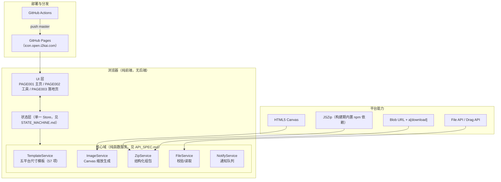
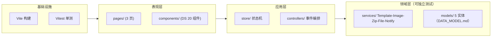

# IconGen 技术架构（P7）

> 依据：docs/01_reverse/REVERSE_ANALYSIS.md（①②⑧）、docs/06_review/PRODUCT_REVIEW.md（§4 公共能力 / B 类优化 / C 类决策）、docs/07_design_system/、PRD §1（核心原则：客户端处理、零上传、零登录、零收费）。
> 本文给出 V1 重开发的技术架构与选型建议。桌面壳去留相关内容均标注【建议，待用户确认】。

---

## 1. 总体架构（V1 目标态）

要点：
1. **无后端**：延续现状（reverse-analysis ⑧：server.js 仅静态服务、线上纯静态）。V1 不引入任何服务器端业务接口。
2. **零上传**：图片仅在浏览器内存/Canvas 处理；ZIP 由 JSZip 在客户端组包。
3. **静态部署**：延续 GitHub Pages + Actions 链路（F025）；CNAME=icon.open.i2kai.com。
4. **落地页（PAGE003）**：独立静态站，部署域名【未知】——是否保留/合并属 C-5 待用户决策，默认不纳入 V1 范围。

## 2. 模块分层

依赖方向单向向下；领域层不依赖 DOM（ImageService 的 Canvas 依赖通过注入适配，便于单测）。

## 3. 选型建议

| 决策点 | 建议 | 理由（可溯源） |
|---|---|---|
| Web 前端框架 | **延续「无框架原生 HTML/CSS/JS」重建**（ES Modules + 现代语法），可选 Vite 作构建工具 | SOP 指定「默认延续现有前端栈」；旧栈为原生（reverse-analysis ①）；功能域小（3 页 1 流程），引入 React/Vue 收益低、成本高。若团队后续需要组件化框架，DS 组件清单（COMPONENT.md 20 项）可直接映射 |
| 样式方案 | 原生 CSS + CSS Variables（docs/07_design_system/TOKEN.md 为唯一变量源）；可选 CSS Modules | TOKEN.md 已完成变量收敛（PG-04 统一基线）；无框架下 Variables 足够 |
| ZIP 依赖 | JSZip 改 **npm 依赖 + 构建期打包**（去掉 CDN script 标签） | P4 B/FL-02：CDN 失败导致下载才报错；旧版 tool/index.html:13 为唯一外部脚本 |
| 本地开发服务器 | 保留 Express 静态服务（web/server.js）或换 `vite dev`（二选一，默认 Vite dev） | 旧 server.js 无业务接口，仅静态；Vite dev 免配置热更 |
| TypeScript | **建议引入**（仅领域层 services/models 强制，表现层可选） | 尺寸模板 57 项、5 实体字段多（DATA_MODEL.md），类型化防错；渐进可接受 |
| 测试 | Vitest（领域层纯函数：模板查询/组包规则/校验）+ Playwright 冒烟（3 页五态） | 组包规则可数值对账（guidelines §4.2 对账表可直接转测试断言）；v0/V1 验收均已用浏览器实测法 |
| CI | GitHub Actions：build → test → deploy Pages（延续 F025 管线并插入 test 作业） | .github/workflows/pages.yml 已存在，扩展即可 |
| 桌面壳（Electron） | 【建议，待用户确认】**V1 阶段暂缓**：不随 web 重建同步重写；保留 desktop/ 归档与差异清单（V1 原型 F032 卡）。若用户决定保留，则按 MODULE_ARCH.md §3 重构并修复 4 项差异（Contents.json 选项 bug、模板对齐、品牌统一、Electron 升级+死链） | P4 C-4；桌面壳与 web 功能对等但双份维护成本高；Electron 25 已老（desktop/package.json） |

## 4. 关键架构决策记录（ADR 摘要）

| # | 决策 | 状态 |
|---|---|---|
| ADR-1 | 纯前端零后端，浏览器本地处理（不上传图片） | 沿用旧版（README 隐私承诺） |
| ADR-2 | JSZip 构建期内置，禁运行时 CDN | 采纳（B/FL-02） |
| ADR-3 | 生成结果缓存，下载复用不重算；配置变更置过期标记 | 采纳（B/FN-09、FL-04） |
| ADR-4 | 通知为堆叠队列（≤3 条并存），替代单条覆盖 | 采纳（B/FL-01） |
| ADR-5 | 尺寸模板/组包规则/文案枚举唯一事实源 = docs/07_design_system/GUIDELINES.md §4（实现侧落在 models/templates.ts，由该文档生成比对测试） | 采纳 |
| ADR-6 | 桌面壳去留 | 【待用户确认】默认暂缓 |
| ADR-7 | 落地页（PAGE003）是否保留/合并/品牌统一 | 【待用户确认】默认不做（C-5） |

## 5. 非功能需求

- 性能：1024 源图五平台 57 项生成（旧版全选实测路径）应在 2s 内完成（Canvas toBlob 并行，旧版已 Promise.all）；ZIP 组包 < 1s。
- 隐私：无网络请求（唯一例外：无——JSZip 内置后完全离线可用）。
- 兼容：现代桌面/移动浏览器（Canvas、File API、Drag API、CSS Variables）；响应式断点见 GUIDELINES.md §3。
- 可维护性：目录结构与 MODULE_ARCH.md 一一对应；公共参数变更走 GUIDELINES.md §4 → 比对测试。
