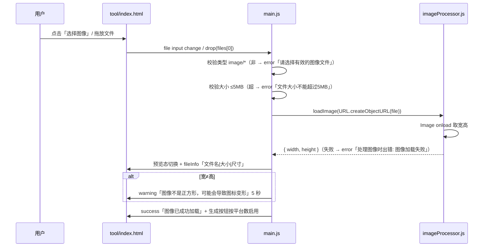
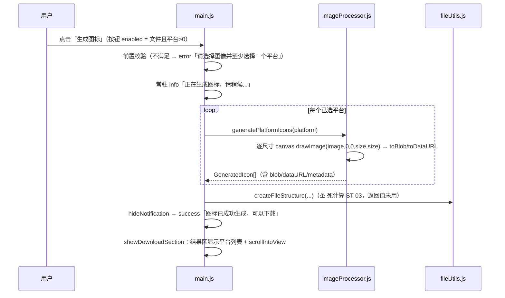
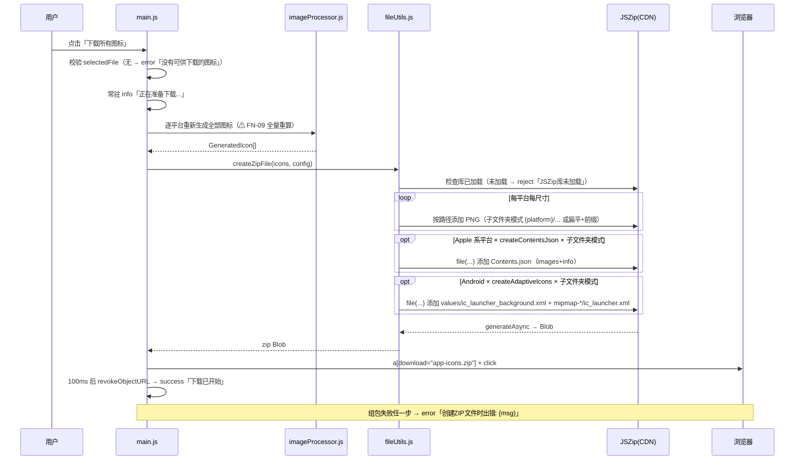
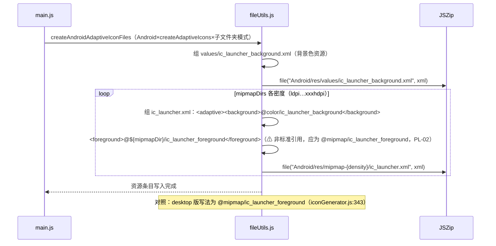
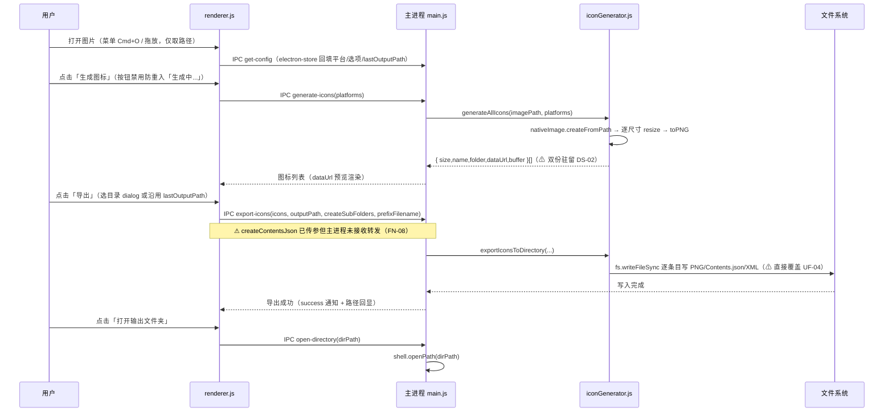
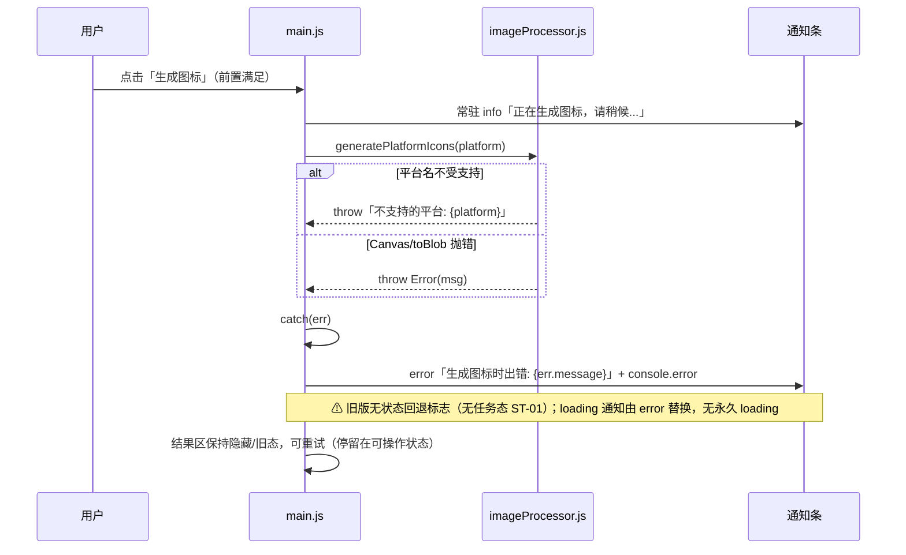

# IconGen 时序图集（SEQUENCE_DIAGRAMS）

> 6 张 sequenceDiagram，覆盖 web 上传→生成→下载、desktop 生成导出、Android 自适应图标 XML 生成、zip 打包、生成失败路径。参与者与消息内容改写自 `docs/01_reverse/REVERSE_ANALYSIS.md` ④、`docs/08_development/DATA_MODEL.md` §3、`docs/08_development/API_SPEC.md` 及 `docs/product-review/` 各评审（源码行号出处见各文）。编写日期：2026-09-03。

---

## SD-1 web 上传 → 校验 → 预览（F001-F007）

来源：REVERSE_ANALYSIS ④ PAGE002「用户操作→系统响应」；`main.js:191-239`。

## SD-2 web 生成 → 结果展示（F010-F011）

来源：`main.js:244-287`；ST-03 见 `docs/product-review/STATE_REVIEW.md`。

## SD-3 web 下载 → zip 打包（F012、F020-F023）

来源：`main.js:350-403`、`fileUtils.js:266-324`；条目数对账（默认 34 / 全平台 67）见 `docs/07_design_system/GUIDELINES.md` §4.2。

## SD-4 Android 自适应图标 XML 生成（F021，含已知缺陷 PL-02）

来源：`web/public/js/fileUtils.js:63-88`；PL-02 见 `docs/product-review/PRODUCT_LOGIC_REVIEW.md` §八。

## SD-5 desktop 生成与本地导出（F032）

来源：`desktop/src/main/main.js`（IPC handlers）；`desktop/src/renderer/renderer.js:55-83,415,476-489`；`iconGenerator.js`（export/write 路径）；REVERSE_ANALYSIS ②。

## SD-6 web 生成失败路径（异常时序）

来源：`main.js:244-287` 异常分支；`docs/product-review/USER_FLOW_REVIEW.md` §三 2；V1 回退规则（S4→S2）见 `docs/04_architecture/STATE_MACHINE.md` §5。
