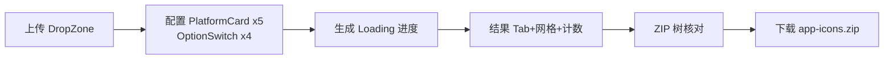

# IconGen Design System — 交互模式（P5）

> 模式 = 可复用的交互解法。全部模式源自旧项目真实行为（docs/06_review/PRODUCT_REVIEW.md §4、page-spec），V1 变更处注明对应 B 类优化编号。

---

## 1. 主流程模式：上传 → 配置 → 生成 → 下载（PAGE002）

- **步骤职责**：一步一卡（上传卡 → 设置卡 → 结果卡），线性推进，卡片纵向排布（D 类 PG 观察：三段职责清晰，V1 保持）。
- **门槛规则（沿用）**：生成按钮 disabled = !(已载入文件 && 至少 1 平台)；全部异常走 Notification 四态反馈，流程不跳页。
- **V1 变更**：
  - B/FN-09、FL-04：生成结果缓存；选项/平台在生成后变更 → 结果区出现「配置已变更」过期提示，建议重新生成（下载仍按当前配置组包，行为与旧版一致但有明确提示）。
  - B/FL-03：生成中显示平台级进度（「iOS ✓ · Android 3/11」），不可取消照旧。
  - B/PG-01：结果区从「平台名列表」升级为 Tab + 网格 + 计数 + ZIP 树（信息层级三层）。

## 2. 校验模式：先拦截、后反馈、不阻断修复

| 校验 | 触发点 | 反馈 | 来源 |
|---|---|---|---|
| 类型（非 image/*） | 上传时 | error「请选择有效的图像文件」，停留空态 | main.js:193-196 |
| 大小（>5MB） | 上传时 | error「文件大小不能超过5MB」 | main.js:199-202 |
| 解码失败 | loadImage reject | error「处理图像时出错: 图像加载失败」 | main.js:235-238 |
| 非正方形（W≠H） | 加载成功后 | warning 5 秒，**不阻断**（可继续生成，拉伸输出） | main.js:226-228 |
| 前置不满足 | 点生成 | error「请选择图像并至少选择一个平台」 | main.js:245-247 |

- 原则：错误只反馈不锁死；用户可换图/改配置后重试。V1 全部沿用文案与阈值（≤5MB、accept=image/*）。
- V1 变更（B/FL-01）：warning 与后续 success 由「覆盖」改为「堆叠并存」（通知队列模式，见 COMPONENT.md §1.5）。

## 3. 空态模式（Empty）

| 场景 | 呈现 | 来源 |
|---|---|---|
| 上传空态 | 云上传 SVG + 引导文案 + hint + 「选择图像」按钮；FileInfo 显示「未选择文件」 | tool/index.html:30-47 |
| 结果空态 | 结果卡片隐藏（初始 display:none）；内置占位 SVG + 「生成图标后将在这里显示」（整卡隐藏时不展示，v0 原型以场景库呈现） | tool/index.html:126-133 |
| FAQ 空态 | 全部收起（无默认展开项） | landing main.js:257-277 |

- 原则：空态必带「下一步动作」入口（按钮或拖放热区），不只放插画。

## 4. 加载模式（Loading）

- 长任务（生成/组包）用常驻 info 通知（duration=0）+ 完成后显式清除再发 success（沿用 main.js:252,276-282,357,396-397）。
- V1 变更（B/FL-03）：常驻通知内嵌平台级进度文本；通知队列下 loading 不与其他通知互斥。
- 图像加载无中间态（同步 objectURL → onload，沿用）。

## 5. 错误模式（Error）

- 统一走 Notification error 态（红底白字右下角）；七类文案枚举见 GUIDELINES.md 公共参数 §3。
- 错误发生时保留用户已完成的上下文（已选平台、已传文件不丢），可直接重试。
- V1 补充（B/FL-02 方向）：依赖缺失（JSZip）属启动期问题，架构上改为构建期内置（P7），运行时不再出现该类错误。

## 6. 成功模式（Success）

- 每个里程碑一个 success 反馈：图像加载成功 → 生成成功（+平滑滚动至结果区 `scrollIntoView({behavior:'smooth'})`）→ 下载开始（「下载已开始」）。
- V1 变更（B/PG-01）：成功不止于通知——结果区本体即成功态可视化（网格 + 计数 + 树）。

## 7. 权限模式（Permission）

- 旧版无账号/角色；文件访问经浏览器 file input / Drag API 授权；无相机/剪贴板等敏感权限。
- 文件选择器取消 = 无事件（静默停留原态，D 类 FL-06 照旧）。
- V1 原型以「场景库-权限」呈现文件读取被拒的假设场景（旧版无此异常分支，如实标注为 V1 演示态，非旧版行为）。

## 8. 配置联动模式

- 平台复选 → 即时 `.selected` 样式 + 生成按钮可用性（main.js:164-185）。
- 选项复选 → 即时写入 config，组包阶段生效（main.js:107-110）。
- 前缀仅非子文件夹模式生效（fileUtils.js:135-137）；V1 加行内说明（B/PG-06）。
- 重置：仅清文件/预览/结果/按钮，**不重置**平台与选项勾选（照旧还原，page-spec PAGE002 补充）。

## 9. 营销页模式（PAGE003）

- 手风琴（互斥）、平滑滚动（锚点 offset -80px）、头部滚动态（>100px 实底）、入场动画（进入视口一次性触发）——全部沿用。
- 表单校验模式：行内标红 + 成功提示 5s + 重置（修复后规格）。
- 外链模式：桌面下载卡新窗口外链；网页版卡站内跳 /tool/；页脚死链不伪造去向（移除或标注）。
