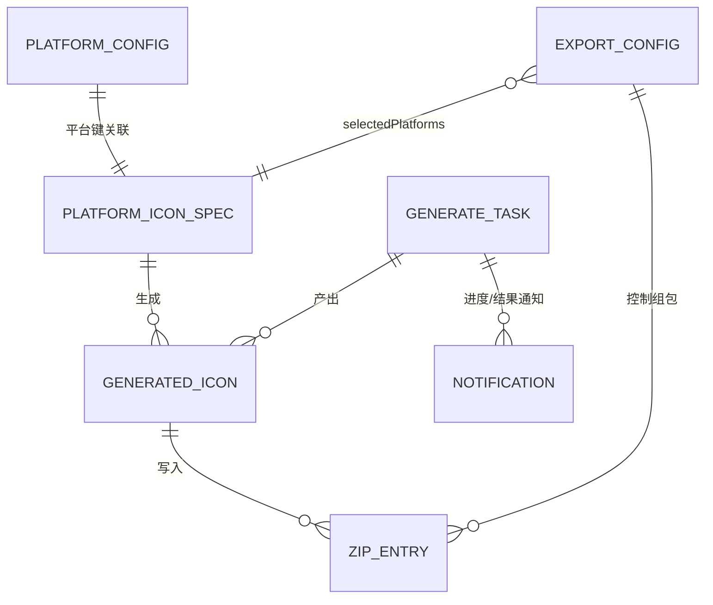
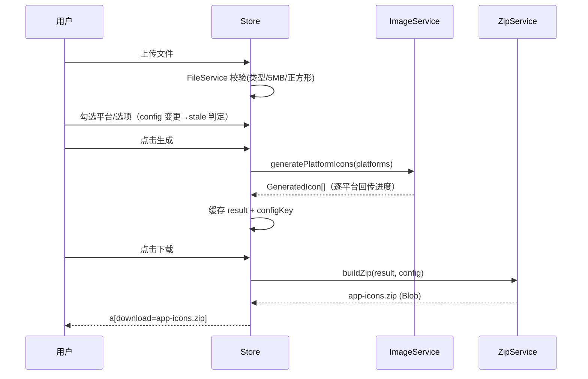

# IconGen 数据模型（P7）

> 对齐逆向报告⑦的 5 实体（PlatformIconSpec / PlatformConfig / Config / GeneratedIcon / Notification），并按 V1 架构（SYSTEM_ARCH.md）补充任务态实体。字段值唯一事实源：docs/07_design_system/GUIDELINES.md §4 与 `web/public/js/iconSizes.js`。

---

## 1. 实体总览（ER）

## 2. 实体定义

### 2.1 PlatformIconSpec 平台尺寸模板（常量，57 项）

来源：`web/public/js/iconSizes.js:5-83`；桌面版对应 `desktop/src/main/iconGenerator.js:6-82`（size 为 'WxH' 字符串，V1 不沿用其差异模板，见 C-4）。

| 字段 | 类型 | 必填 | 说明 | 示例 |
|---|---|---|---|---|
| size | number | ✓ | 图标边长 px | 180 |
| name | string | ✓ | 输出文件名 | icon-60@3x.png / ic_launcher.png / Square44Logo.png |
| folder | string | 平台内目标目录（Android 必填） | AppIcon.appiconset / mipmap-xhdpi / Assets |
| idiom | 'iphone'\|'ipad'\|'ios-marketing'\|'watch'\|'watch-marketing' | Apple 系 | iphone |
| scale | '1x'\|'2x'\|'3x'\|'100' | Apple 系倍率（Windows 旧值为 '100'，V1 保留字符串枚举以兼容 Contents.json 计算） | 3x |
| role | 'notificationCenter'\|'companionSettings'\|'appLauncher'\|'longLook'\|'quickLook' | watchOS | appLauncher |
| subtype | '38mm'\|'42mm'\|'44mm' | watchOS | 44mm |
| type | 'launcher'\|'adaptive' | Android | launcher |
| description | string | 中文说明 | iPhone应用图标@3x |

集合：`{ iOS: 15, Android: 11, macOS: 10, Windows: 10, watchOS: 11 }`。

### 2.2 PlatformConfig 平台资源配置（常量）

来源：`iconSizes.js:104-130`（PLATFORM_CONFIGS / PLATFORM_FOLDERS / PLATFORM_FORMATS）。

| 字段 | 类型 | 说明 | 值 |
|---|---|---|---|
| platformKey | enum | 平台键 | iOS / Android / macOS / Windows / watchOS |
| needsContentsJson | boolean | Apple 系生成 Contents.json | iOS/macOS/watchOS=true |
| needsAdaptiveIcons | boolean | Android 自适应 XML | Android=true |
| needsManifest | boolean | Windows 清单（空实现） | Windows=false |
| assetsDir / iconsetDir | string | Apple 资产目录 | Assets.xcassets / AppIcon.appiconset |
| resDir / mipmapDirs / valuesDir | string / string[] | Android 资源目录 | res / [mipmap-ldpi…xxxhdpi] / values |
| rootFolder | string | ZIP 内平台根目录 | 与 platformKey 同名 |
| format | 'png' | 输出格式 | 五平台均 png |

### 2.3 ExportConfig 导出配置（用户态）

来源：web 内存态 `main.js:35-40`；desktop 持久化（electron-store，键见 desktop main.js get-config）——V1 web 版为会话内存态，不持久化（照旧）。

| 字段 | 类型 | 默认 | 说明 |
|---|---|---|---|
| selectedPlatforms | PlatformKey[] | ['iOS','Android'] | 已选平台（DOM 顺序） |
| createSubFolders | boolean | true | 平台子文件夹结构 |
| prefixFilename | boolean | false | 文件名平台前缀（仅 !createSubFolders 生效） |
| createContentsJson | boolean | true | Apple Contents.json |
| createAdaptiveIcons | boolean | true | Android 自适应 XML |

派生只读字段（V1 新增，STATE_MACHINE.md 使用）：`configKey`（平台排序 + 四开关序列化，用于结果过期判断，B/FL-04）。

### 2.4 GeneratedIcon 生成图标（任务产物）

来源：web `imageProcessor.js:242-273`；desktop `iconGenerator.js:128-139`。

| 字段 | 类型 | 说明 |
|---|---|---|
| size | number | 边长 |
| name | string | 文件名（组包阶段可被前缀改写为 `{platform}-{name}`） |
| folder | string | 平台内目录 |
| blob | Blob | PNG 二进制（web；Canvas toBlob） |
| dataURL | string | PNG dataURL（预览用） |
| metadata | Spec 附加字段 | idiom/scale/role/subtype/type/description 透传（Contents.json 组装用） |

关系：GeneratedIcon 1..n 属于平台；Config 控制其在 ZipService 中的路径与附加文件。

### 2.5 Notification 通知（UI 态）

来源：`main.js:445-469`。V1 队列化（B/FL-01）后新增 `id`。

| 字段 | 类型 | 说明 |
|---|---|---|
| id | number | 队列内唯一（V1 新增，用于定向清除常驻项） |
| type | 'info'\|'success'\|'error'\|'warning' | 四态 |
| message | string | 文案（枚举见 guidelines §4.3，不得意译） |
| duration | number | 毫秒；默认 3000，0=常驻 |

### 2.6 ZipEntry ZIP 条目（V1 显式化，旧版隐含于 fileUtils 调用链）

来源：`fileUtils.js:111-324` 行为抽象。

| 字段 | 类型 | 说明 |
|---|---|---|
| path | string | ZIP 内全路径（如 iOS/Assets.xcassets/AppIcon.appiconset/icon-20.png） |
| kind | 'png'\|'contentsJson'\|'adaptiveXml'\|'backgroundXml' | 条目类型 |
| payload | Blob \| string | 二进制或文本（json/xml 文本） |
| source | GeneratedIcon.ref \| 'platform-config' | 来源引用 |

### 2.7 GenerateTask 生成任务（V1 新增，对齐 STATE_MACHINE.md）

| 字段 | 类型 | 说明 |
|---|---|---|
| taskId | string | 自增 |
| status | 'idle'\|'generating'\|'done'\|'error' | 任务态 |
| progress | { platform: string; doneInPlatform: number; totalInPlatform: number; finishedPlatforms: string[] } | 平台级进度（B/FL-03） |
| result | { icons: Record<PlatformKey, GeneratedIcon[]>; configKey: string; zipModel: ZipEntry[] } \| null | 结果缓存（B/FN-09：下载复用） |
| stale | boolean | 生成后配置变更 → true（B/FL-04） |
| error | string \| null | 错误信息（error 通知透传） |

## 3. 数据流（写路径）

## 4. 校验规则（实体约束）

- FileSource（上传输入）：type ∈ image/*；size ≤ 5MB；width/height 由解码获得；width≠height → warning 不阻断。
- ExportConfig 约束：prefixFilename 仅在 createSubFolders=false 时影响输出（fileUtils.js:135-137）。
- ZipEntry 数量不变式（guidelines §4.2 对账表）：全平台全选项 = 57 PNG + 10 资源 = 67 条目；默认 iOS+Android = 26+8 = 34 条目——作为 V1 回归测试断言。
- Contents.json images[].size = floor(size / parseInt(scale))（fileUtils.js:30）。
